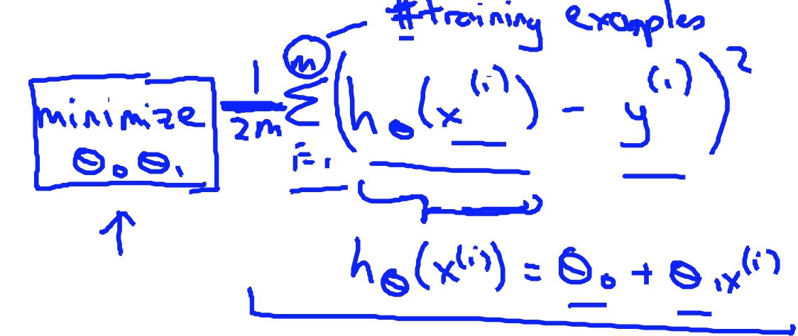
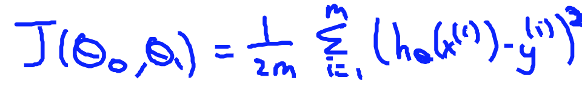
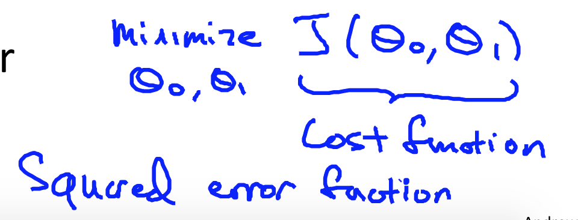
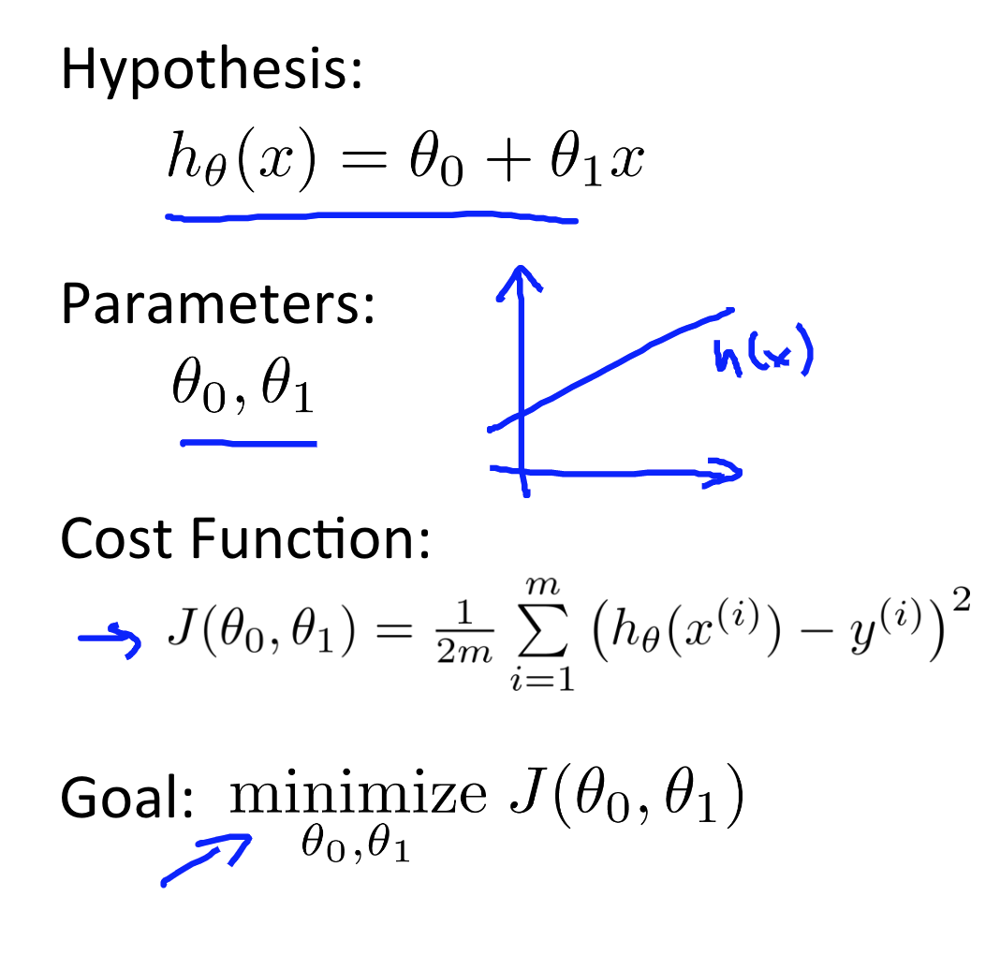
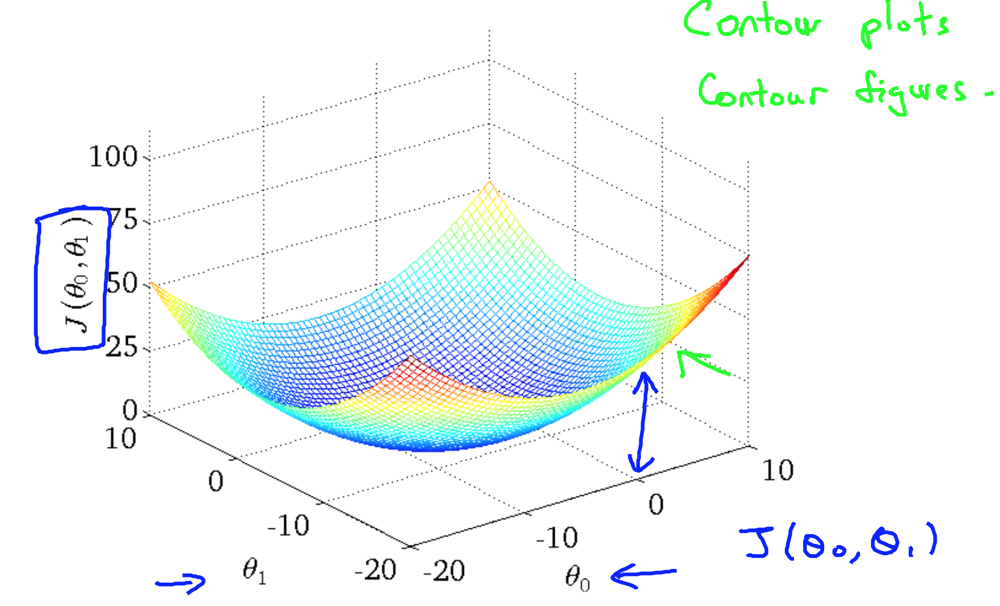
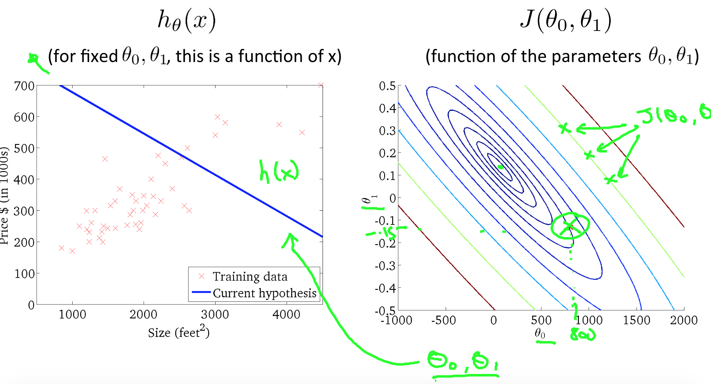

# Model Representation

 - is supervised learning
 
## Example
Size of House(X) -> h (Hypothesis) -> Estimated Price(Y)

h maps X to Y

## Representing h
h(x) = theta[0] + theta[1] * x

# Cost Function
Recall that hypothesis is h(x) = theta[0] + theta[1] * x

But how to choose theta[i]?

## Idea
Choose theta[0], theta[1] so that h(x) is close to y for our training examples (x,y).

## In equation

Step 1: The following represents minimizing theta[0] and theta[1] to match our output(y) as much as possible

Step 2: Let J(theta[0], theta[1]) be most of our cost function.

Step 3: Combine step 1 and step 2 equations to get

Equation J(theta[0], theta[1]) is also known as the **"Squared Error Function"**.

## Summary

# Gradient Descent
 - Finding best theta[0] and theta[1] to minimize cost function.

 - If we plot J(theta[0],theta[1]), theta[0] and theta[1] together, we should see something like this:

 - Looking below, the right side is the same graph as above, but the J(theta[0], theta[1]) is sqeezed down and we are using a xy-plot on theta[0] and theta[1]. 
 - The circled circle represents a selected J(theta[0],theta[1]). And how that looks like on our cost function is shown on the graph on the left.

 - The global minimum point (of J(theta[0], theta[1])) is our optimial solution because we want the smallest cost possible - but how do we find that?

 - The answer is **Gradient Descent**.

