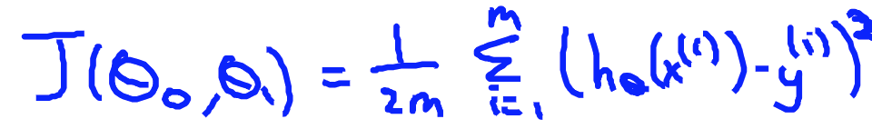

1. Consider the problem of predicting how well a student does in her second year of college/university, given how well she did in her first year.

Specifically, let x be equal to the number of "A" grades (including A-. A and A+ grades) that a student receives in their first year of college (freshmen year). We would like to predict the value of y, which we define as the number of "A" grades they get in their second year (sophomore year).

Here each row is one training example. Recall that in linear regression, our hypothesis is hθ(x) = θ[0] + θ[1]x[1], and we use 'm' to denote the number of training examples.

For the training set given above (note that this training set may also be referenced in other questions in this quiz), what is the value of m? In the box below, please enter your answer (which should be a number between 0 and 10).

**Answer:**
4

---

2. For this question, assume that we are using the training set from Q1. Recall our definition of the cost function was . What is J(0,1)? In the box below, please enter your answer (Simplify fractions to decimals when entering answer, and '.' as the decimal delimiter e.g., 1.5).

hθ(x) = θ[0] + θ[1]X

θ[0] = 0, θ[1] = 1

hθ(x) = (0) + (1)X = X

J(θ[0],[1]) = Cost Function = (1/2m)(hθ(x[i]) - y[i])^2
 = (1/(2 * 4))(1^2 + (-1)^2 + 1^2 + 1^2) = **0.5**

---

3. Suppose we set θ[0] = 0,θ[1]=0.5. What is hθ(2)?

hθ(2) = 0 + (1.5)(2) = **3**

---

4.
Let f be some function so that f(θ[0],θ[1]) outputs a number. For this problem, f is some arbitrary/unknown smooth function (not necessarily the cost function of linear regression, so f may have local optima). Suppose we use gradient descent to try to minimize f(θ[0], θ[1]) as a function of θ[0] and θ[1]. Which of the following statements are true? (Check all that apply.)

 - If θ[0] and θ[1] are initialized so that θ[0]=θ[1], then by symmetry (because we do simultaneous updates to the two parameters), after one iteration of gradient descent, we will still have θ[0]=θ[1].
   - The updates to θ[0] and θ[1] are different (even though we're doing simultaneous updates), so there's no particular reason to expect them to be the same after one iteration of gradient descent.
 - Setting the learning rate α to be very small is not harmful, and can only speed up the convergence of gradient descent.
   - If the learning rate is small, gradient descent ends up taking an extremely small step on each iteration, so this would actually slow down (rather than speed up) the convergence of the algorithm.
 - **If the first few iterations of gradient descent cause f(θ[0],θ[1]) to increase rather than decrease, then the most likely cause is that we have set the learning rate α to too large a value.**
   - If alpha were small enough, then gradient descent should always successfully take a tiny small downhill and decrease f(θ[0],θ[1]) at least a little bit. If gradient descent instead increases the objective value, that means alpha is too large (or you have a bug in your code!).
 - **If the learning rate is too small, then gradient descent may take a very long time to converge.**
   - If the learning rate is small, gradient descent ends up taking an extremely small step on each iteration, and therefore can take a long time to converge.

---

5. Suppose that for some linear regression problem (say, predicting housing prices as in the lecture), we have some training set, and for our training set we managed to find some θ[0], θ[1] such that J(θ[0],θ[1])=0. Which of the statements below must then be true? (Check all that apply.)

 - For this to be true, we must have θ[0]=0 and θ[1]=0 so that hθ(x)=0
   - If J(θ[0],θ[1])=0, that means the line defined by the equation "y=θ[0]+θ[1]x" perfectly fits all of our data. There's no particular reason to expect that the values of θ[0] and θ[1] that achieve this are both 0 (unless y(i)=0 for all of our training examples).
 - **Our training set can be fit perfectly by a straight line, i.e., all of our training examples lie perfectly on some straight line.**
   - If J(θ[0],θ[1])=0, that means the line defined by the equation "y=θ[0]+θ[1]x" perfectly fits all of our data.
 - For this to be true, we must have y(i)=0 for every value of i=1,2,…,m.
   - So long as all of our training examples lie on a straight line, we will be able to find θ[0] and θ[1] so that J(θ[0],θ[1])=0. It is not necessary that y(i)=0 for all of our examples.
 - We can perfectly predict the value of y even for new examples that we have not yet seen. (e.g., we can perfectly predict prices of even new houses that we have not yet seen.)
   - Even though we can fit our training set perfectly, this does not mean that we'll always make perfect predictions on houses in the future/on houses that we have not yet seen.