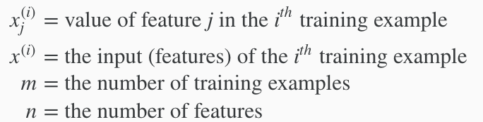
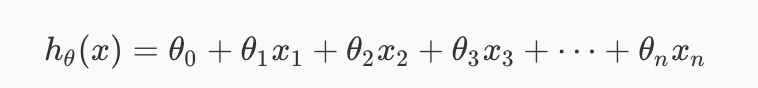
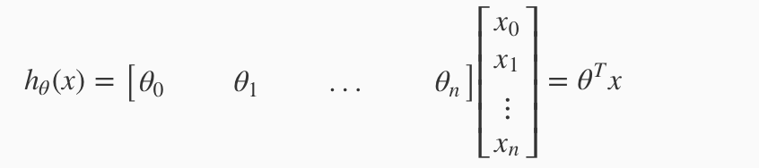
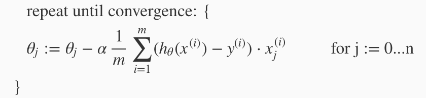

# Multiple Features

Before, we start, consider this notation:

The multivariable form of the hypothesis function:

a
This can be written in matrix form:

Gradient Descent for Multiple Variable:

## Gradient Descent: Feature Scaling

### I) Feature Scaling
**Idea:** 
 - Make sure features are on a similar scale ("similar scale" - meaning similar range of values).
 - You want to make it between 0 < x < 1

**Default**:
 - The equation is often: x[i] := (x[i] - μ[i])/s[i], where μ[i] is average for all values for feature(i) and s[i] is the range of the values (max - min) (or sometimes, the stdev)

**Example:**
 - x1: size (0-2000ft^2)
 - x2: number of bedroom (1-5)

To convert to similar scale:
 - x1 = size/2000
 - x2 = (# bedroom)/5

### II) Mean Normalization
Replace X[i] with X[i]-μ[i] to make features have approximately zero mean.

**Example:**
x1 = (size-1000)/2000
x2 = (# bedroom - 2)/5 

Thus, feature is -0.5 < (x1, x2) < 0.5

