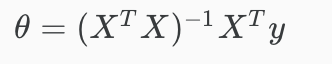

# Normal Equation
Gradient descent gives one way of minimizing J. **Let’s discuss a second way of doing so.** 

In the "Normal Equation" method, we will minimize J by **explicitly taking its derivatives with respect to the θj ’s, and setting them to zero**. This allows us to find the optimum theta without iteration. The normal equation formula is given below:

## Example

 - There is **no need** to do feature scaling with the normal equation.
 - Note that we are adding a column of 1s in the X.

| Gradient Descent | Normal Equation |
| ---------------- | --------------- |
| Need to choose Alpha | No need to choose Alpha |
| Needs many iterations | No need to iterate | 
| O(kn^2) | O(n^3), need to calculate inverse of tranverse(X)*X |
| Works well when n is large | Slow if n is large |

In practice, when **n exceeds 10,000**, it might be a good time to go from a normal solution to an iterative process.

# Normal Equation Noninvertibility

In Octave, you should use 'pinv' instead of 'inv' because 'pinv' gives you θ even if tranv[X] * X is not invertible.

If tranv[X] * X is not invertable, the common causes are often:
 - Redundant Features: where 2 features are closely related (eg. linearly dependent)
  - Too many features.
