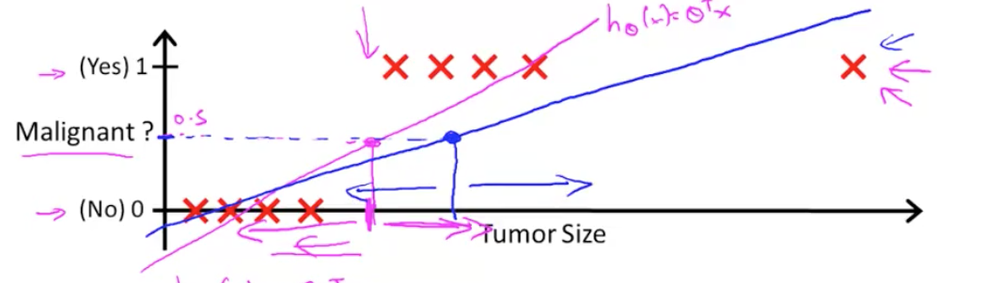
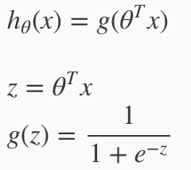
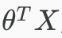
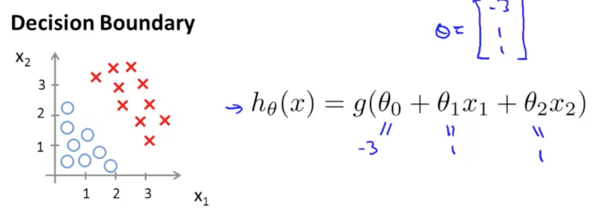
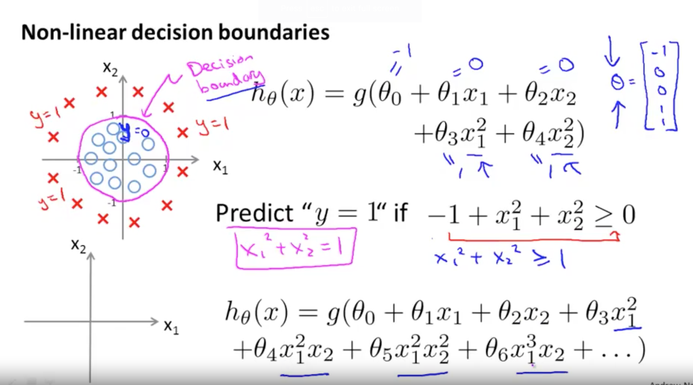

# Classification
To attempt classification, one method is to use linear regression and map all predictions greater than 0.5 as a 1 and all less than 0.5 as a 0. However, this method doesn't work well because classification is not actually a linear function.

## "classification is not actually a linear function"?

Looking at the graph above, the original cost function is denoted by the pink line (hθ[x]). However, when we add one more dataset (the X on the far right), it will then skew the line to the right, and we don't want that.

 For now, we will focus on the **binary classification problem** in which y can take on only two values, 0 and 1. (Most of what we say here will also generalize to the multiple-class case.) 
 
 For instance, if we are trying to build a spam classifier for email, then x[i]
  may be some features of a piece of email, and y may be 1 if it is a piece of spam mail, and 0 otherwise. Hence, y∈{0,1}. 0 is also called the negative class, and 1 the positive class, and they are sometimes also denoted by the symbols “-” and “+.”

# Hypothesis Representation
We could approach the classification problem ignoring the fact that y is discrete-valued, and **use our old linear regression algorithm** to try to predict y given x. However, it is easy to construct examples where this method performs very poorly. Intuitively, it also doesn’t make sense for hθ(x) to take values larger than 1 or less than 0.

To fix this, we use the "**Sigmoid Function**" (also called "Logistic Function"). 

hθ(x) will give us the probability that our output is 1. For example, hθ(x)=0.7 gives us a probability of 70% that our output is 1. 

Our probability that our prediction is 0 is just the complement of our probability:

hθ[x] = P(y=1) = 1 - P(y=0)

# Decision Boundary
Let x be our input, and y be out output.

1) In order to get our discrete 0 or 1 classification, we can translate the output of the hypothesis function as follows:

- hθ(x) ≥ 0.5 → y = 1
- hθ(x) < 0.5 → y = 0

2) The way our logistic/sigmoid function g behaves is that when its input is greater than or equal to zero, its output is greater than or equal to 0.5:

 - g(z) ≥ 0.5 when z ≥ 0

 

3) Also "hθ(x) = g(z)"

Therefore, combining (1) and (2):
If we sub g(z) ≥ 0.5 with y = 1 (and vice versa), then we get:
 - Predict "y=1" when z ≥ 0
 - Predict "y=0" when z < 0

 ## What is z?

z is also represented as . 

 be can an equation of sorts.

Example:

## More complicated Decision Boundary

