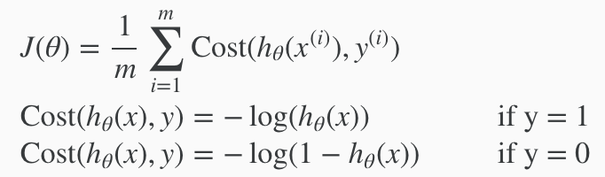
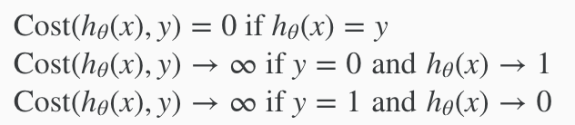
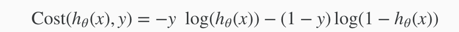
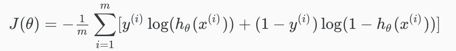
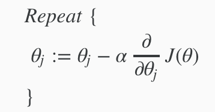
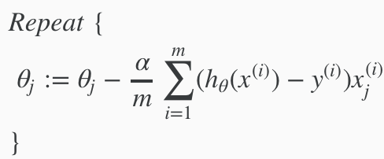
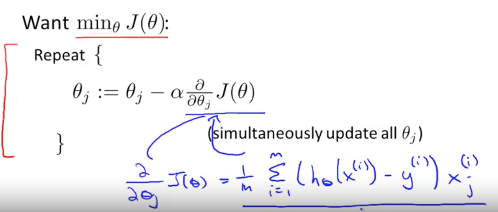

# Cost Model
We cannot use the same cost function that we use for linear regression because the Logistic Function will cause the output to be wavy, causing many local optima. In other words, it will not be a convex function.

Instead, our cost function for logistic regression looks like:

When y = 1, we get the following plot for J(θ),hθ(x):

Similarily, y = 0, we get:

Denoted below: If the correct answer(y) is 1, and our hypothesis(hθ[x]) is 1, then the cost is zero. Conversely, if our hypothesis is 0, then the cost is inifinite. vice versa for y=0.

# Simplified Cost Function and Gradient Descent
If you combine the cost function (per data) above, you get:

To write it fully, it's:

# Gradient Descent

Recall from previously that the gradient descent algorithm is:

The α * deriative(J(θ)) is actually same as our linear regression, which is:

# Advanced Optimizations
**"Conjugate gradient", "BFGS", and "L-BFGS"** are more sophisticated, faster ways to optimize θ that can be used instead of gradient descent. We suggest that you should not write these more sophisticated algorithms yourself (unless you are an expert in numerical computing) but use the libraries instead, as they're already tested and highly optimized. Octave provides them.

