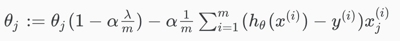

# The Problem of Overfitting

Consider the problem of predicting y from x ∈ R. In the leftmost figure below, we try to fit a  to a dataset. But we see that the data doesn’t really lie on straight line, and so the fit is not very good.

 

In the middle figure, to improve the fit, we added an extra feature x^2 and fit 
. We achieve a slightly better fit. 

A **misconception is "adding more features = better"**. There is a danger in adding too many features. As shown in the rightmost figure, we try to fit a 

Although the fitted curve **fits perfectly to our training data, we would not expect this to be a very good predictor** of, say, housing prices (y) for different living areas (x). 

# Cost Function

If we have overfitting from our hypothesis function, we can **reduce the weight** that some of the terms in our function carry **by increasing their cost**.

Say we wanted to make the following function more quadratic:  

Without actually getting rid of these features or changing the form of our hypothesis, we can instead modify our cost function:

We've **added two extra terms at the end to inflate the cost of θ[3] and θ[4].**

Now, in order for the cost function to get close to zero, we will have to reduce the values of θ[3] and θ[4] to near zero. This will in turn greatly reduce the values of θ[3] and θ[4] in our hypothesis function. As a result, we see that the new hypothesis (depicted by the pink curve) looks like a quadratic function but fits the data better due to the extra small terms θ[3] and θ[4].

We could also regularize all of our theta parameters in a single summation as:

The **λ**, or lambda, is the regularization parameter. It determines **how much the costs of our theta parameters are inflated**.

Using the above cost function with the extra summation, we can **smooth the output of our hypothesis function to reduce overfitting**. 

**If lambda is chosen to be too large**, it may smooth out the function too much and **cause underfitting**. 

Hence, what would happen if λ=0 or is too small ?

# Regularized Linear Regression

We can apply regularization to both linear regression and logistic regression. We will approach linear regression first.

## Gradient Descent

We will modify our gradient descent function to separate out 0[0] from the rest of the parameters because we do not want to penalize 0[0].

The term (λ/m)θ[j] performs our regularization. With some manipulation, our update rule can also be represented as:

 (This is really just subbing 0[j] on the outside.)

The first term in the above equation, 1 - α(λ/m) will always be less than 1.
Intuitively, you can see it as reducing the value of 0[j] by some amount on every update. Notice that the second term is now exactly the same as it was before.

## Normal Equation
Now let's approach regularization using the **alternate method** of the **non-iterative** normal equation.

To add in regularization, the equation is the same as our original, except that we add another term inside the parentheses:

L is a matrix with 0 at the top left and 1's down the diagonal, with 0's everywhere else. It should have dimension (n+1)×(n+1). Intuitively, this is the identity matrix (though we are not including x[0]), multiplied with a single real number λ.

Recall that if m < n, then trav(X)*X is non-invertible. However, when we add the term λ⋅L, then trav(X)*X + λ⋅L becomes invertible.

# Regularized Logistic Regression

We can regularize logistic regression in a similar way that we regularize linear regression. As a result, we can avoid overfitting. 

The following image shows how the regularized function, displayed by the pink line, is less likely to overfit than the non-regularized function represented by the blue line:

## Cost Function

Recall that our cost function for logistic regression was:

We can regularize this equation by adding a term to the end:

The second sum,  means to explicitly exclude the bias term, θ[0]. I.e. the θ vector is indexed from 0 to n (holding n+1 values, θ[0] through θ[n], and this sum explicitly skips θ[0], by running from 1 to n, skipping 0. Thus, when computing the equation, we should continuously update the two following equations:

