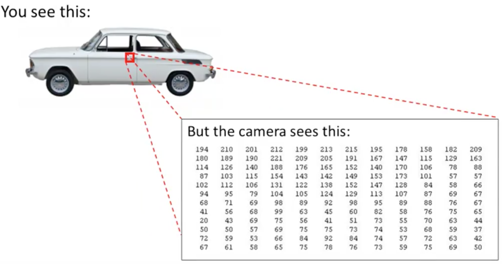
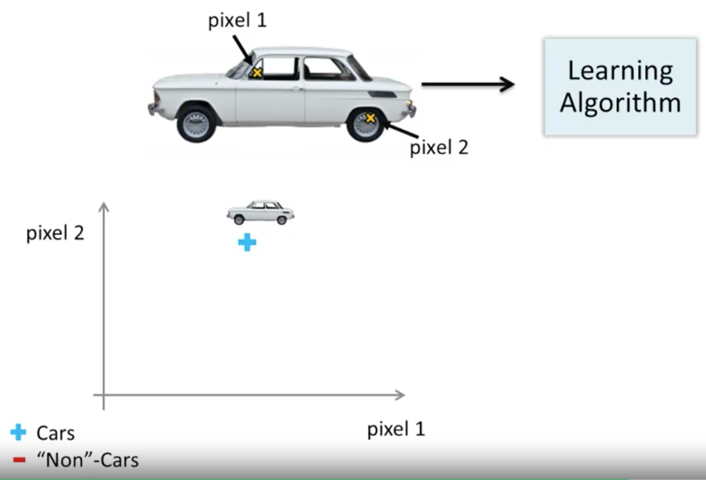
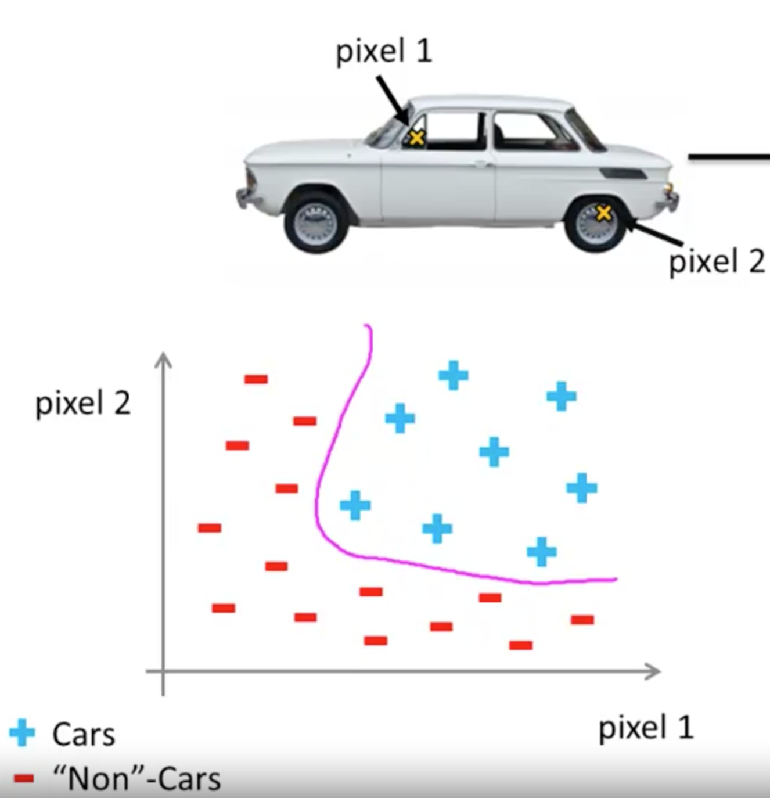
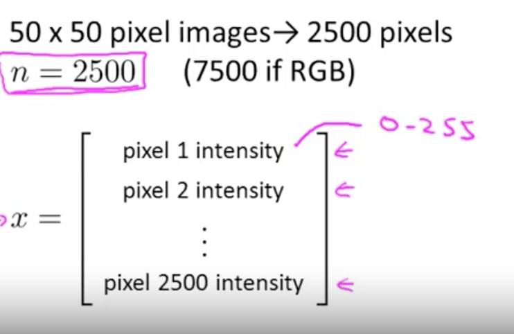

# Non-Linear Hypothesis
Suppose you have a non-linear regression with a lot of features (as shown below).

 

Suppose we have 100 features. If we were to include all quadratic terms (meaning second or polynomial terms), there would be a lot of them. Specifically, around 5000 features. (approx n^2/2 to n^2):

Another option is to include only a subset of these. But you will not get anywhere close to the classification denoted by the pink line in the graph above.

For many machine learning problems, n will be pretty large. Here's an example.

# How to solve computer vision problem with machine learning?

Suppose you want to use machine learning to train a classifier to examine an image and tell us whether or not the image is a car.

Let's zoom into a small part of the image like that area where the little red rectangle is. It turns out that where you and I see a car, the computer sees that. What it sees is this matrix, or this grid, of pixel intensity values that tells us the brightness of each pixel in the image. So the computer vision problem is to look at this matrix of pixel intensity values, and tell us that these numbers represent the door handle of a car.

Concretely, when we use machine learning to build a car detector, what we do is we come up with a label training set, with, let's say, a few label examples of cars and a few label examples of things that are not cars, then we give our training set to the learning algorithm trained a classifier and then, you know, we may test it and show the new image and ask, "What is this new thing?". Hopefully, it predicts a car.

Let's pick a couple of pixel locations in our images, so that's pixel one location and pixel two location, and let's plot this car, you know, at the location, at a certain point, depending on the intensities of pixel one and pixel two.

Let's plot some negative examples as well. And if we do this for more and more examples using the pluses to denote cars and minuses to denote non-cars, what we'll find is that the cars and non-cars end up lying in different regions of the space, and what we need therefore is some sort of non-linear hypotheses to try to separate out the two classes.

### What is the dimension of the feature space?

Suppose we were to use 50x50 pixel images; thus we have 2500 pixels to deal with.

The dimension of our feature size will be N equals 2500 where our feature vector x is a list of all the pixel brightnesses; from pixel 1 to the last pixel. These are usually represented using values between 0 to 255 if it gives us the grayscale value. 
If we were using RGB images, we have to separate by red, green and blue, thus, having 7500 pixels.

If we are to include all quadratic features, then we will end up with approx 3 million features (~= n^2/2). And that's just too large to be reasonable; the computation would be very expensive to find and to represent all of these three million features per training example.

Simple logistic regression together with adding in maybe the quadratic or the cubic features is simply not a good way to learn complex nonlinear hypotheses when n is large because you just end up with too many features. 

As a result, we use neural networks, which turns out to be a much better way to learn complex hypotheses and complex nonlinear hypotheses even when n is large. 
