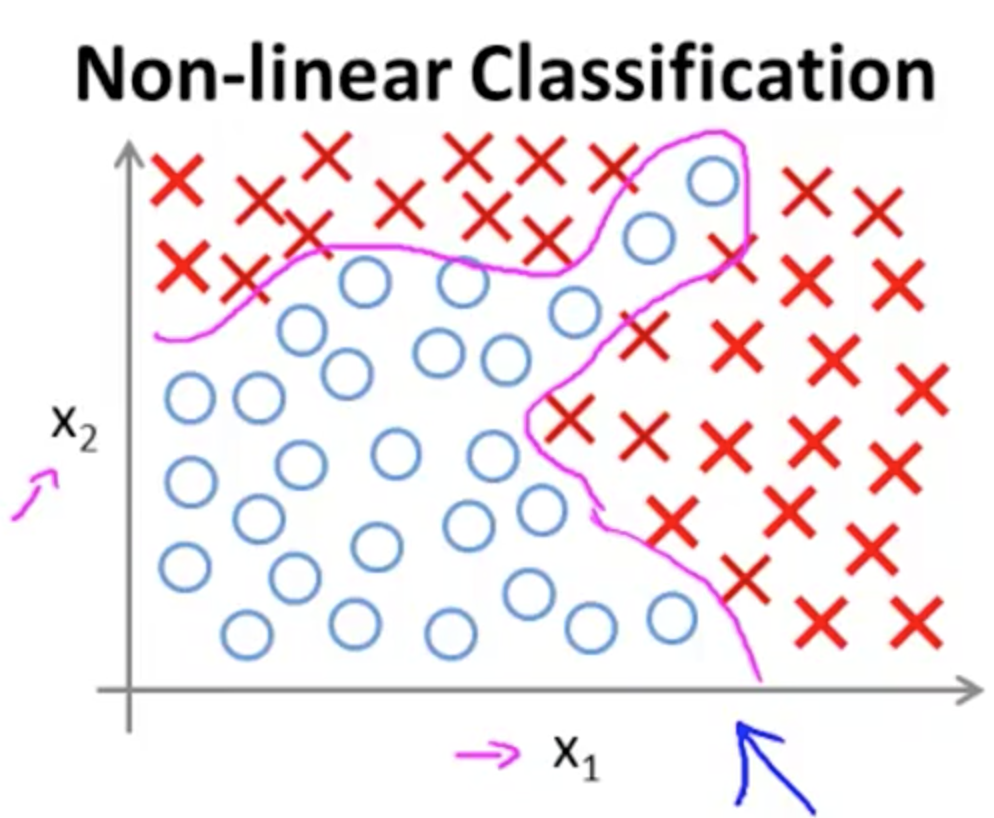
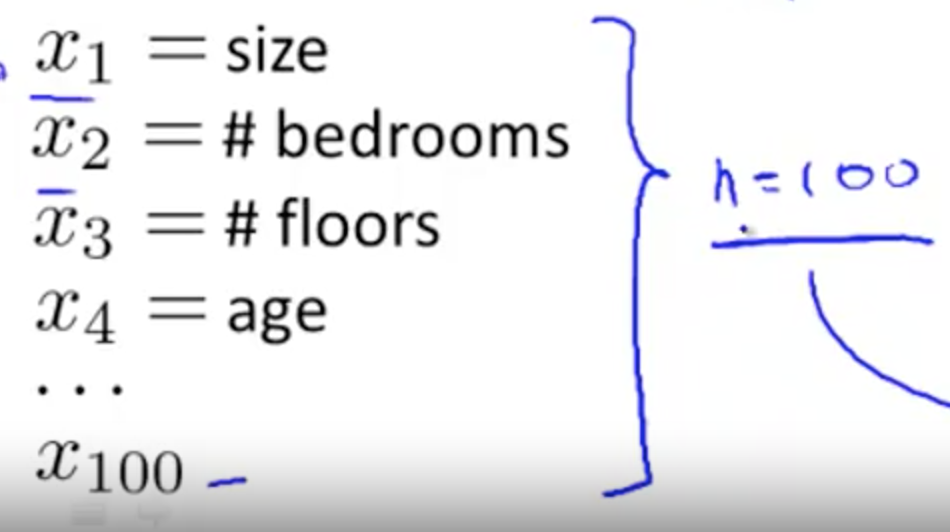
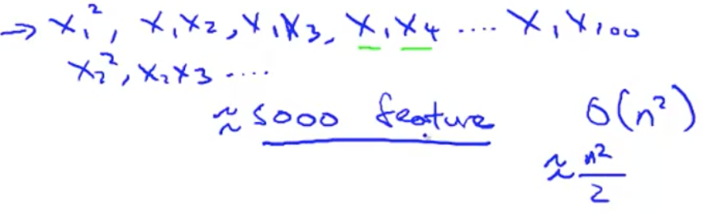

# Non-Linear Hypothesis
Suppose you have a non-linear regression with a lot of features (as shown below).

 

Suppose we have 100 features. If we were to include all quadratic terms (meaning second or polynomial terms), there would be a lot of them. Specifically, around 5000 features. (approx n^2/2 to n^2):

Another option is to include only a subset of these. 