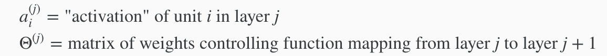
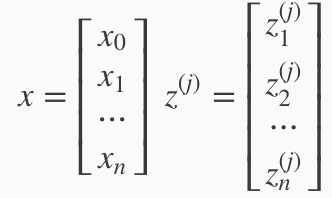

# Modelling Neural Network

To begin, we will examine how we  represent a hypothesis function using neural networks. At a very simple level, neurons are basically computational units that take inputs (dendrites) as electrical inputs (called "spikes") that are channeled to outputs (axons). 

In our model, input features are x[1]⋯x[n], and the output is the result of our hypothesis function. Additionally, there is something called a "bias unit", that that is located in our x[0]; it is always equal to 1. In neural networks, we use the same logistic function as in classification (the sigmoid activation function), . In this situation, our "theta" parameters are sometimes called "weights".

Visually, a simplistic representation looks like:

As shown above:
 - layer 1([x0,x1,x2]) is known as "input layer" because it contains our input nodes. 
 - layer 3 (hθ[x]) outputs the hypothesis function and thus, is known as the "output layer".
 - All layers input and output layers called the "hidden layers." Here, it is simply [].

Next, we label the intermediate or "hidden" layer nodes  and call them "activation units."

The notations are:

If we had one hidden layer, it would look like:

The values for each of the "activation" nodes is obtained as follows:

Each layer gets its own matrix of weights, Θ[j].

The dimensions of these matrices of weights is determined as follows:

Note that the +1 comes from the "bias nodes,x[0].

# Vectorized Implementation of Neural Network

In this section we'll do a **vectorized implementation** of the above functions. We're going to define a new variable  that encompasses the parameters inside our g function. In our previous example if we replaced by the variable z for all the parameters we would get:

In other words, for layer j=2 and node k, the variable z will be:
 

The vector representation of x and z^{j} is:
 

Setting x = a^(1), we can rewrite the equation as:
 

Above, we are multiplying our matrix Θ^(j−1) with dimensions s[j]*(n+1) (where s[j] is the number of our activation nodes) by our vector a^(j-1) with height (n+1). This gives us our vector z^(j) with height s[j]. Now we can get a vector of our activation nodes for layer j as follows:
a^(j) = g(z^(j))

Where our function g can be applied element-wise to our vector z^(j)

We can then add a bias unit (equal to 1) to layer j after we have computed a^(j). This will be element a^(j)[0] and will be equal to 1. To compute our final hypothesis, let's first compute another z vector:

z^(j+1) = Θ^j * a^j

We get this final z vector by multiplying the next theta matrix after Θ^(j−1) with the values of all the activation nodes we just got. This last theta matrix Θ^(j) will have only one row which is multiplied by one column a^(j) so that our result is a single number. We then get our final result with:

hΘ(x) = a^(j+1) = g(z^(j+1))

Notice that in this last step, between layer j and layer j+1, we are doing exactly the same thing as we did in logistic regression. Adding all these intermediate layers in neural networks allows us to more elegantly produce interesting and more complex non-linear hypotheses.

