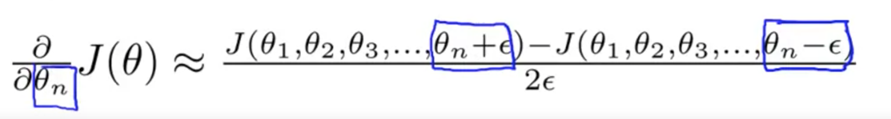

# Implementation Note: Unrolling Parameters

With neural networks, we are working with sets of matrices:

> Θ^(1),Θ^(2),Θ^(3),…

> D^(1),D^(2),D^a(3),…

In order to use optimizing functions such as "fminunc()", we will want to "unroll" all the elements and put them into one long vector:

> thetaVector = [ Theta1(:); Theta2(:); Theta3(:); ]

> deltaVector = [ D1(:); D2(:); D3(:) ]

If the dimensions of Theta1 is 10x11, Theta2 is 10x11 and Theta3 is 1x11, then we can get back our original matrices from the "unrolled" versions as follows:

> Theta1 = reshape(thetaVector(1:110),10,11)

> Theta2 = reshape(thetaVector(111:220),10,11)

> Theta3 = reshape(thetaVector(221:231),1,11)

# Gradient Checking

Gradient checking will assure that our backpropagation works as intended. We can approximate the derivative of our cost function with:

With multiple theta matrices, we can approximate the derivative with respect to Θ_j as follows:

A small value for ϵ (epsilon) such as ϵ=10^(-4), guarantees that the math works out properly. If the value for ϵ is too small, we can end up with numerical problems.

Hence, we are only adding or subtracting epsilon to the Θ_j matrix. In octave we can do it as follows:

We previously saw how to calculate the deltaVector. So once we compute our gradApprox vector, we can **check that gradApprox ≈ deltaVector**

Once you have verified once that your backpropagation algorithm is correct, you don't need to compute gradApprox again. The code to compute gradApprox can be very slow.

## Intuition

# Random Initialization
Initializing all theta weights to zero does not work with neural networks. When we backpropagate, all nodes will update to the same value repeatedly. Instead we can randomly initialize our weights for our Θ matrices using the following method:

rand(x,y) is just a function in octave that will initialize a matrix of random real numbers between 0 and 1.

(Note: the epsilon used above is unrelated to the epsilon from Gradient Checking)

# Putting it Together

First, pick a network architecture; choose the layout of your neural network, including how many hidden units in each layer and how many layers in total you want to have.

 - Number of input units = dimension of features x^(i)
 - Number of output units = number of classes
 - Number of hidden units per layer = usually more the better (must balance with cost of computation as it increases with more hidden units)
 - Defaults: 1 hidden layer. If you have more than 1 hidden layer, then it is recommended that you have the same number of units in every hidden layer.

## Training a Neural Network
1. Randomly initialize the weights
2. Implement forward propagation to get hΘ(x(i)) for any x^(i)
3. Implement the cost function
4. Implement backpropagation to compute partial derivatives
5. Use gradient checking to confirm that your backpropagation works. Then disable gradient checking.
6. Use gradient descent or a built-in optimization function to minimize the cost function with the weights in theta.

When we perform forward and back propagation, we loop on every training example:

The following image gives us an intuition of what is happening as we are implementing our neural network:

Ideally, you want hΘ(x^(i)) ≈ y^(i). This will minimize our cost function. However, keep in mind that J(Θ) is not convex and thus we can end up in a local minimum instead.
