# Cost Function
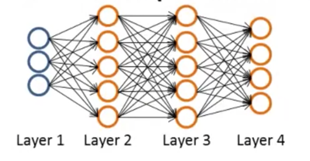

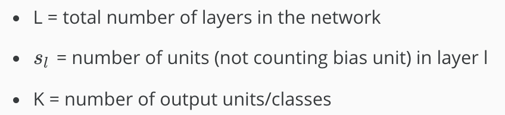

First, recall that the cost function for regularized logistic regression was:
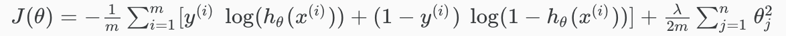

For neural network, it's slightly different:
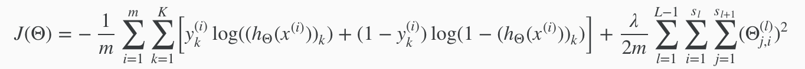

Recall that in neural networks, we may have many output nodes. We denote 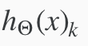 as being a hypothesis that results in the k-th output. 

We have added a few nested summations to account for our multiple output nodes. In the first part of the equation, before the square brackets, we have an additional **nested summation that loops through the number of output nodes**.

In the regularization part (after the square brackets), we must **account for multiple theta matrices**. The number of columns in our current theta matrix is equal to the number of nodes in our current layer (including the bias unit). The number of rows in our current theta matrix is equal to the number of nodes in the next layer (excluding the bias unit). 

## Note:
 - the double sum simply adds up the logistic regression costs calculated for each cell in the output layer
 - the triple sum simply adds up the squares of all the individual Θs in the entire network.
 - the i in the triple sum does not refer to training example i

# Back Propagation Algorithm

"Backpropagation" is neural-network terminology for minimizing our cost function, just like what we were doing with gradient descent in logistic and linear regression. Our goal is to compute:

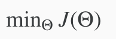

Here, we will look at how we can use back propagation to compute the partial derivative of J(Θ): 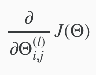

Below are more detailed information about steps after "For i=1 to m:"

1. Set a^(1) = x^(i)

2. Perform forward propagation to compute a^(l) for l = 1,2,3...,L

3. 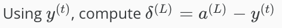

Where **L = our total number of layers** and **a^(L) = the vector of outputs of the activation units for the last layer**. 

Thus, **"error values" for the last layer = the differences of our actual results in the last layer and the correct outputs in y.** 

To get the delta values of the layers before the last layer, we can use an equation that steps us back from right to left:

4. 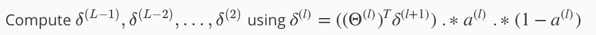

The **"delta values of layer l" are calculated by multiplying the delta values in the next layer with the theta matrix of layer l.** We then element-wise multiply that with a function called g', or g-prime, which is the derivative of the activation function g evaluated with the input values given by z^(l).

 The g-prime derivative terms can also be written out as:
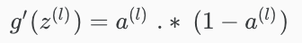

In more details:
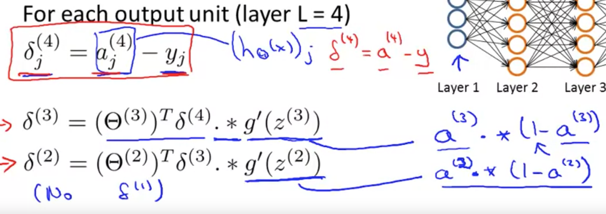

As shown above, delta(4)(final layer) and delta(1) are calculated differently.

5. 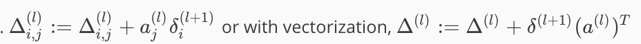

Hence we update our new Δ matrix.

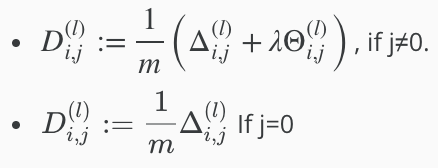

The capital-delta matrix D is used as an "accumulator" to add up our values as we go along and eventually compute our partial derivative. Thus we get 

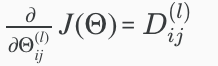

# Backpropagation Intuition

Recall that the cost function for a neural network is:

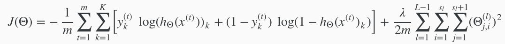

If we consider simple non-multiclass classification (k = 1) and disregard regularization, the cost is computed with:

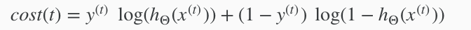

Intuitively, δ^(l)_j is the "error" for a^(l)_j (unit j in layer l). More formally, the delta values are actually the derivative of the cost function:

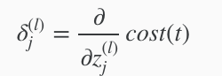

Recall that our derivative is the slope of a line tangent to the cost function, so the steeper the slope the more incorrect we are. Let us consider the following neural network below and see how we could calculate some δ^(l)_j.

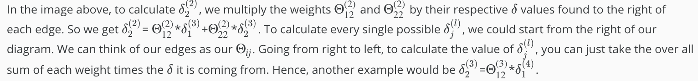
