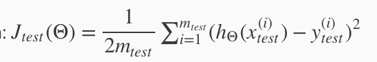
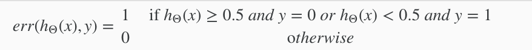
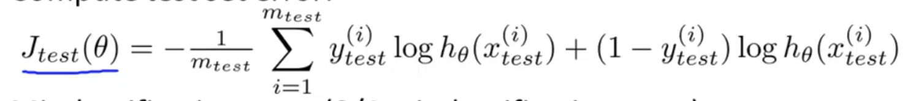
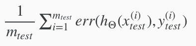
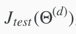

# Deciding what to do next?
**So how do you know what to focus on to improve performance of your machine learning system?** This chapter will present practical suggestions, advice, guidelines on how to do that.

# Evaluating a Hypothesis

## 1) Trouble Shooting Errors 
We can **trouble shoot for errors** in our predictions by the following methods:
 - Getting more training examples
 - Trying smaller sets of features
 - Trying additional features
 - Trying polynomial features
 - Increasing or decreasing λ

## 2) Evaluate new Hypothesis
A **hypothesis may have a low error for the training examples but still be inaccurate** (because of **overfitting**). Thus, to evaluate a hypothesis, given a dataset of training examples, we can **split up the data into two sets**: a training set and a test set. Typically, the training set consists of **70%** of your data and the test set is the remaining **30%**.

The new procedure using these two sets is then:

1. Learn Θ and minimize  using the training set
2. Compute the test set error 

### Test Set Error
1. For linear regression: 

2. For classification, we can use:

Which is same as:

This gives us a binary 0 or 1 error result based on a misclassification. The **average test error** for the test set is:

Test Error = 

This gives us the proportion of the test data that was misclassified.

# Model Selection and Train/Validation/Test Sets
**Just because a learning algorithm fits a training set well, that does not mean it is a good hypothesis.**

It could over-fit and as a result your predictions on the test set would be poor. The error of your hypothesis on the training set will be lower than that in other sets (Cross validation & test).

It's hard to decide between the different polynomial degrees for our model. We can use a **systematic approach** to identify the 'best' function. In order to choose the model of your hypothesis, you can test each degree of polynomial and look at the error result.

## 1) Break down Data Set
One way to **break down** our dataset into the three sets is:
 - Training set: 60%
 - Cross validation set: 20%
 - Test set: 20%

## 2) Calculate Separate Error Values
We can now calculate three separate error values for the three different sets using the following method:

  1. **Optimize** the parameters in **Θ** using the **training set** for each polynomial degree.
  2. Find the **polynomial degree d with the least error** using the **cross validation** set.
  3. Estimate the **generalization error** using the **test set** with 
, (d = theta from polynomial with lower error);

This way, the degree of the **polynomial d has NOT been trained** using the test set.
