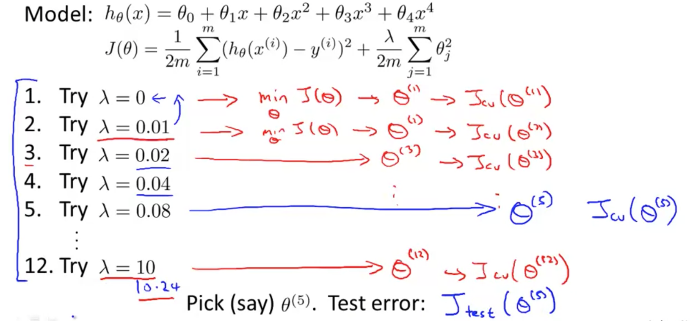

# Diagnosing Bias vs Variance

Here, we examine the **relationship between the degree of the polynomial d and the underfitting or overfitting of our hypothesis**.

**High bias is underfitting and high variance is overfitting.** Usually, a higher degree of polynomial will result in overfitting (variance) and vice versa. Ideally, we need to find a **golden mean** between these two.

As we increase degree of polynomial: 
 - Training error will decrease.
 - Cross Validation error will decrease to a point, and then increase; forming a convex circle.

## Classifying Bias vs Variance
High bias (underfitting): 
 - both J_train(Θ) and J_CV(Θ) will be high. 
 - JCV(Θ)≈Jtrain(Θ).

High variance (overfitting): 
 - J_train(Θ) will be low 
 - J_CV(Θ) will be much greater than J_train(Θ).

The is summarized in the figure below:

# Regularization and Bias/Variance

In the figure above, we see that as λ increases, our fit becomes more rigid. On the other hand, as λ->0, we tend to overfit the data. So how do we choose our parameter λ to get it 'just right' ? In order to choose the model and the regularization term λ, we need to:

1. Create a list of lambdas (i.e. λ ∈ {0, 0.01, 0.02, 0.04, 0.08, 0.16, 0.32, 0.64, 1.28, 2.56, 5.12, 10.24});
2. Create a set of models with different degrees or any other variants.
3. For each λ, process different models and get some Θ.
4. Then, compute the cross validation error using the learned Θ (computed with λ) on the JCV(Θ) **without** regularization or λ = 0.
5. Select the best combo (of Θ and λ) that produces the lowest error on the cross validation set.
6. Using the best combo Θ and λ, apply it on Jtest(Θ) to see if it has a good generalization of the problem.

## Bias/Variance as a function of regularization parameter λ

# Learning Curve
Training an algorithm on a very few number of data points (such as 1, 2 or 3) will easily have 0 errors because we can always find a quadratic curve that touches exactly those number of points. 

Hence:
 - As the training set gets larger, the error for a quadratic function increases.
 - The error value will plateau out after a certain m, or training set size.

## Experiencing High Bias:
 - Low training set size: causes Jtrain(Θ) to be low and JCV(Θ) to be high.
 - Large training set size: causes both Jtrain(Θ) and JCV(Θ) to be high with Jtrain(Θ)≈JCV(Θ).

If a learning algorithm is suffering from high bias, getting more training data **will NOT** (by itself) help much.

## Experiencing High Variance
 - Low training set size: Jtrain(Θ) will be low and JCV(Θ) will be high.
 - Large training set size: Jtrain(Θ) increases with training set size and JCV(Θ) continues to decrease without leveling off. 
 - Jtrain(Θ) < JCV(Θ) but the difference between them remains significant.

If a learning algorithm is suffering from high variance, getting more training data is **likely to help**.

# Deciding What to Do Next Revisited

Our decision process can be broken down as follows:
 - Getting more training examples: Fixes high variance
 - Trying smaller sets of features: Fixes high variance
 - Adding features: Fixes high bias
 - Adding polynomial features: Fixes high bias
 - Decreasing λ: Fixes high bias
 - Increasing λ: Fixes high variance.

## Diagnosing Neural Networks
A neural network with **fewer parameters** is prone to **underfitting**. It is also computationally cheaper.

A **large** neural network with **more parameters** is prone to **overfitting**. It is also computationally expensive. In this case you can use regularization (increase λ) to address the overfitting.

**Using a single hidden layer is a good starting default**. You can train your neural network on a number of hidden layers using your cross validation set. You can then select the one that performs best.

## Model Complexity Effects:
 - Lower-order polynomials (low model complexity) have high bias and low variance. In this case, the model fits poorly consistently.
 - Higher-order polynomials (high model complexity) fit the training data extremely well and the **test data extremely poorly**. These have low bias on the training data, but very high variance.

In reality, we would want to choose a model somewhere in between, that can generalize well but also fits the data reasonably well.

