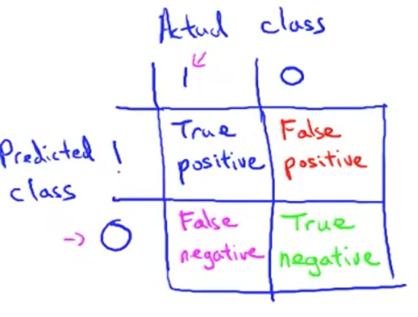
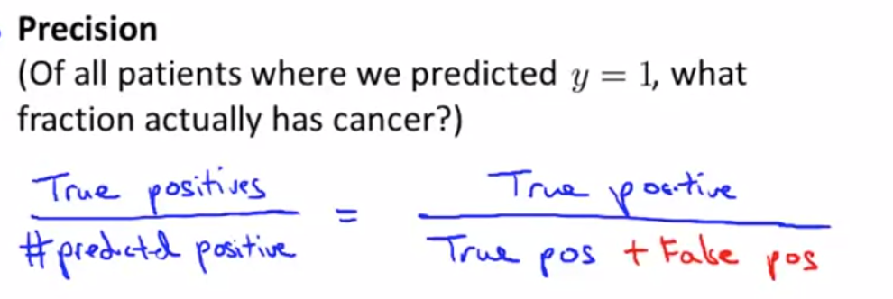
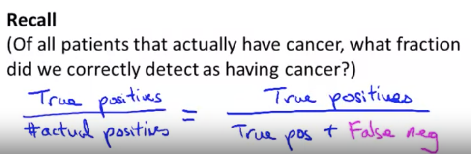
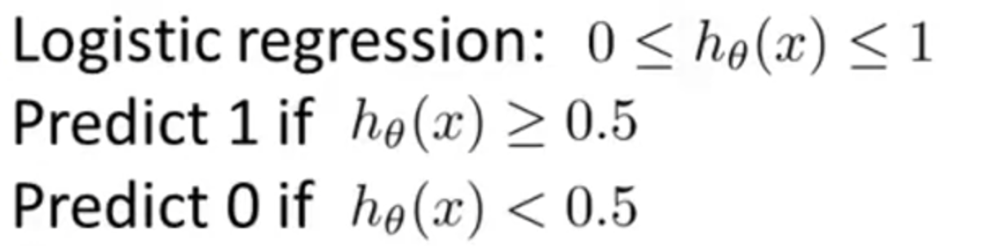
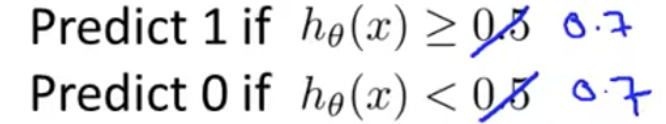
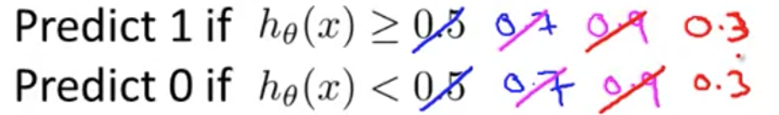
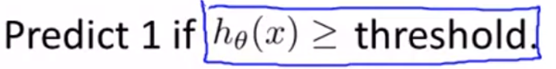
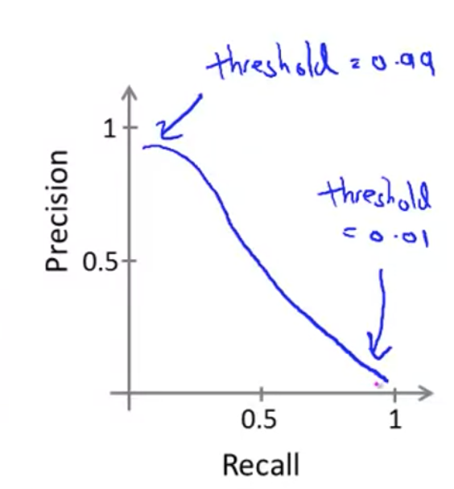
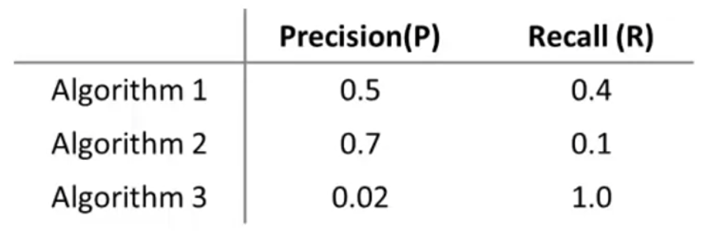
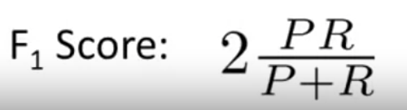

# Error Metrics for Skewed Classes

In the previous chapter, we talked about the importance of having a single real number evaluation metric for your learning algorithm to tell how well it's doing. In the context of evaluation and of error metrics, a tricky topic is **Skewed Classes**.

## Skewed Classes

Consider the problem of cancer classification, where we have features of medical patients and we want to decide whether or not they have cancer (This is like the malignant versus benign tumor classification example). 

Assume: 
 - y = 1 if the patient has cancer 
 - y = 0 if they do not. 

We have trained the progression classifier and get 1% error (or 99% correct) on a test set. Impressive? 

However, if only 0.5% of patients in our training test sets actually have cancer, then the 1% error is not impressive because a piece of non-learning code that predicts y=0 all the time will already achieve 0.5% error (better than our 1% error).

**Skewed classes is when the ratio of positive to negative examples is at two ends of extremes.**

If you have very skewed classes it becomes much harder to use just classification accuracy, because you can **get very high classification accuracies or very low errors, and it's not always clear if doing so is really improving the quality of your classifier.**

As seen in our example, predicting y = 0 all the time doesn't seem like a particularly good classifier; but it was able to bring our error lower to 0.5%.

## Precision-Recall: Error Metrics for Skewed Classes

When we're faced with such a skewed classes, we  want to come up with a different error metric or a different evaluation metric. One such evaluation metric are what's called **precision recall**. 

Below is a 2x2 table as follows:

We're going to compute two numbers. 

### Precision
The first is called **precision**, which asks - _of all the patients where we've predicted that they have cancer, what fraction of them actually have cancer?_

In other words, of all the patients that we went to those patients and we told them, "We think you have cancer." Of all those patients, what fraction of them actually have cancer? 

As you can tell high precision would be good. That means that of the group of patients we predicted have cancer, most of them actually have cancer. 

### Recall

The second number we're going to compute is called **recall**, which asks - of all patients that actually have cancner, what fraction did we correctly detect as having cancer?

### Precision-Recall

By computing precision and recall, this will usually give us a **better sense of how well our classifier is doing**. In particular, if we have a learning algorithm that predicts y = 0 all the time, if it predicts no one has cancer, then this classifier will have a recall = 0.

It's **not possible for an algorithm to "cheat" and get a very high precision and a very high recall** by doing some simple thing like predicting y = 0 all the time or vice versa. 

## Decicidng y=1 or y=0 to calculate Precision-Recall

We usually use y=1, in the presence of the **more rare class** we are trying to detect. For example, having cancner.

# Trading Off Precision and Recall

Suppose we define our hypothesis as:

## Higher Precision (Lower Recall)
Suppose we want to predict y=1 (cancer) **only if we are confident** (because we don't want to false alarm scare our customers).

One way to do this is to achieve higher precision (and as a result, lower recall) by modifying our algorithm to a higher threshold; as shown below:

## Higher Recall (Lower Precision)

Suppose we want to avoid missing too many cases of cancer (avoid false negatives) - because if we tell our customer they don't have cancer, but they actually do, then they will miss their treatment.

In contrast to increasing precision, we can achieve higher recall (as a result, lower precision) by modifying our algorithm to a lower threshold; as shown below:

## Precision-Recall Curve

As you plot out different precision and recall for various thresholds, using , you will see something like:

 

(NOTE: the curve can come in very different shapes)

## F1 Score
 

Assume we have results shown above. It's hard to decide whether we need a higher or lower precision/recall. So is there a **standardized way to decide the best precision-recall**? Yes, there is - the F1 Score (or just F Score).

We know that a particularly high or low precision and recall results in a bad classifier. As a result, the average of precision-recall is not a good metric. 

(P = precision, R = recall)

If either P or R = 0, then F score = 0. This captures both low Ps and low Rs, which usually means a bad classifier.
