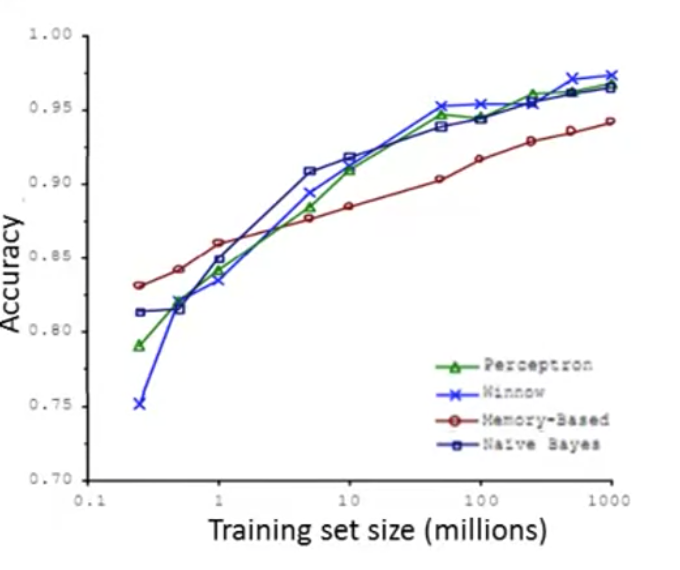

# Data for Machine Learning

## Designing a high accuracy Learning System

In 2001, Banko and Brill were interested in the problem of classifying between confusable words, for example: 

For the statement, "For breakfast, I ate ____ eggs."

Should the blank be: 'two', 'too' or 'to'?

They took a few ML algorithms (considered state-of-the-art back then) to test, namely:
 - Perceptron (Logistic Regression)
 - Winnow
 - Memory-Based
 - Naive Bayes

They found that as the training set size increase, the accuracy of all algorithms increase. The conclusion is that if you give an in-theory algorithm enough data, it will increase in accuracy.

Thus, the saying: "It's not who has the best algorithm that wins, It's who has the most data."

## Large Data Rationale

Is having more data always going to lead to more accuracy?

Our example above seems to imply 'yes'. But if we were to *"Predict housing price from only size (feet^2) and no other feature"*, then it is **unlikely that more data will increase accuracy** because there are many variables outside of size that affects price.

A useful test is to ask: **"Given input x, can a human expert confidently predict y?"**

