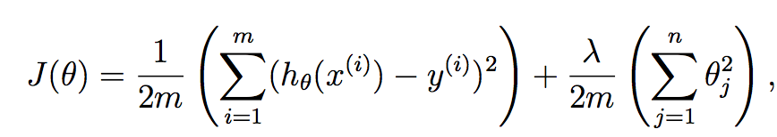
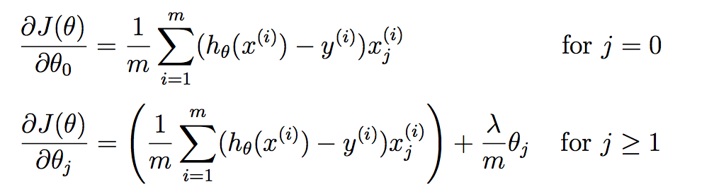

# Summary of ex5

1. Create a cost function to compute cost and gradient.

2. Compute the optimal values of THETA using fmincg (to optimize the cost function).

 - set regularization to 0.

# Determining Bias vs Variance (Learning Curves)

Following the example above, compute error values for training and cv set; based on different sizes. (x=size of dataset, y=error)
 - set lambda = 0

# Finding best lambda

1. Get a list of lambdas to test.
2. Calculate error for training and CV set.
3. Pick best lambda by plotting a cross validation curve of: x = lambda, y = error

