# Optimization Objective

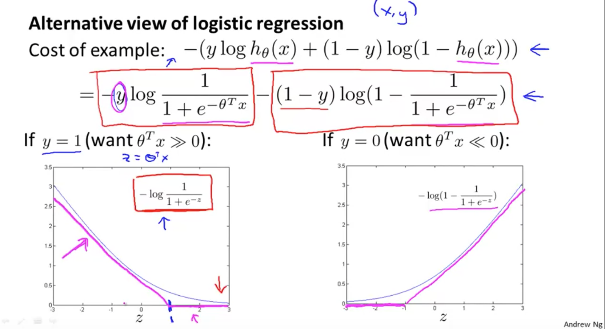

Recall how logistic regression formula works from the diagram above (where z = theta * x)

If y=1, then we want our hypothesis to be 1 (achieving zero cost). (theta * X) is also likely be to much greater than zero.

In contrast, if y=0, then we want our hypothesis to be 0 (achieving zero cost). (theta * X) is also likely be to much lower than zero.

Thus, we use the cost of example shown above.

## Mathematical Approach to Getting SVM Hypothesis

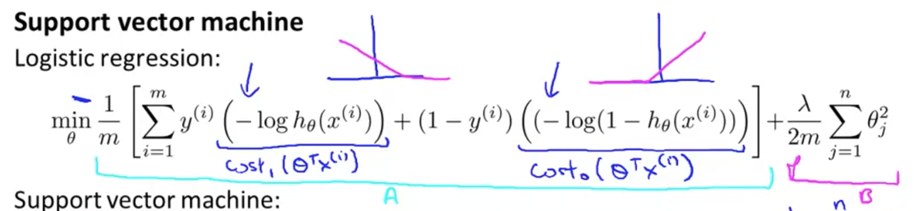

1. Using the idea fo logistic regression from above, let's take it further and substitute -log(hx) and -log(1-hx) with cost1(theta * X) and cost0(theta * X). Then, we get the formula below.

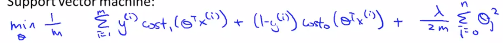
 
2. Next, we remove m. 
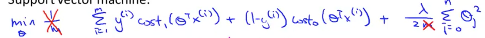

The reason we can do this is demonstrated in example below:

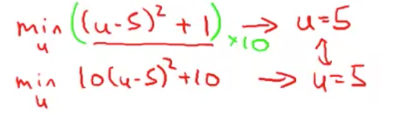

As you can see above, no matter what the scalar values are, u is minimized to 5. 

In the same way, we can remove m from the svm hypothesis because it's a scalar. 

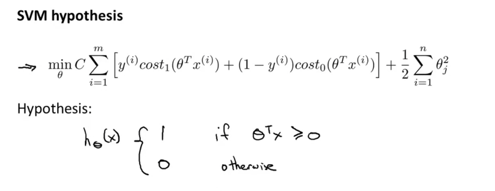

# Large Margin Intuition

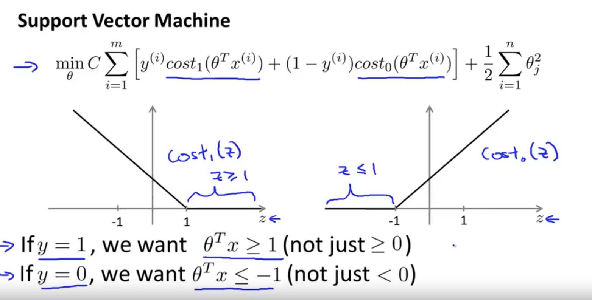

Again, if we have y=1, then we want (theta * x) >= 1 (and not just >= 0, as >= 1 has lower cost). Vice versa.

## Margin of SVM

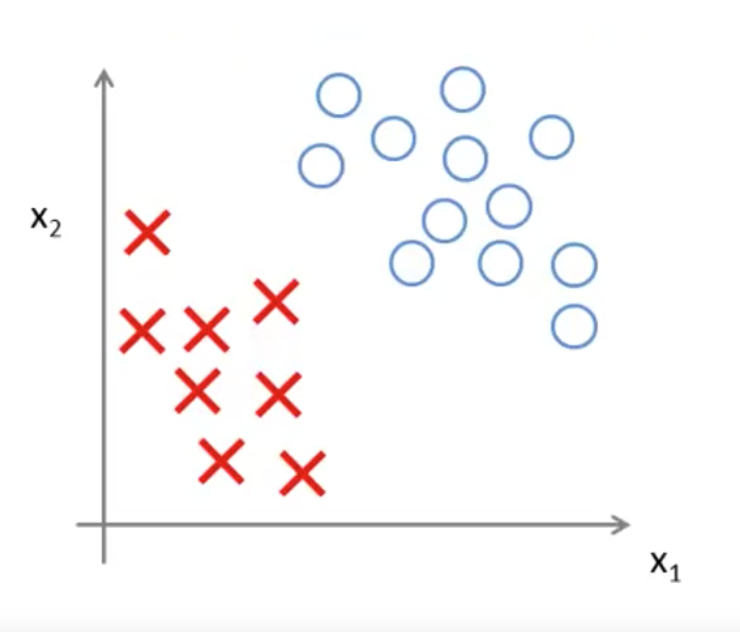

In the graph above, there are multiple ways we can separate the graph.

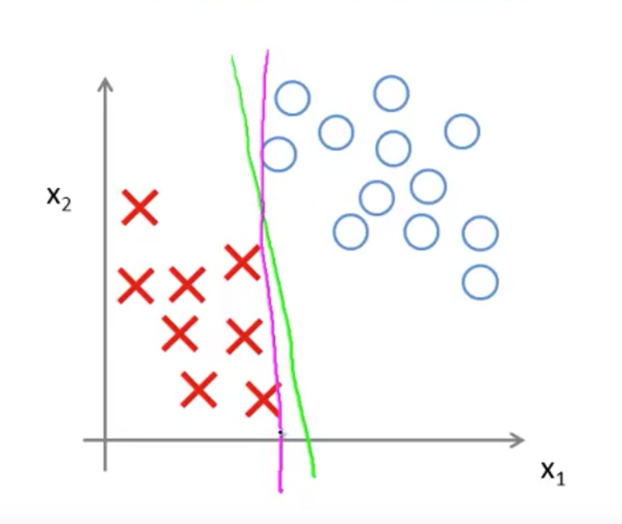

The green and violet lines are possible solutions. But the black line below seems to be a better fit.

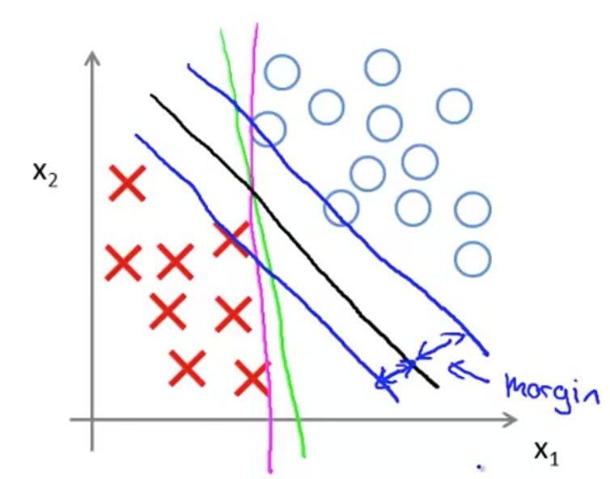

The blue lines around the black line. The distance between the blue lines to black line is called "margin of the support vector machine". This gives the SVM a certain robustness, because it tries to separate the data with as a large a margin as possible.

## Outliers and Regularization

If we had a dataset like below:
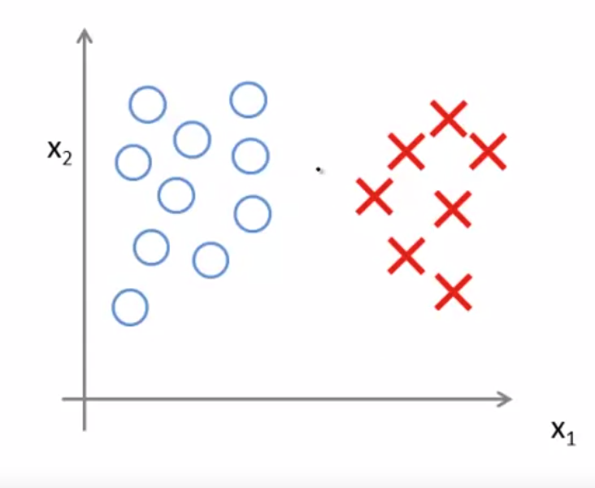

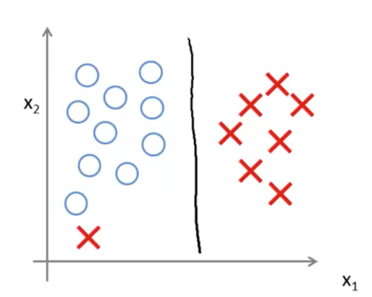

It is very obvious our svm will choose the black line, but if a outlier data set (the 'x' lower left) appears, our svm might skew torwards the pink line.

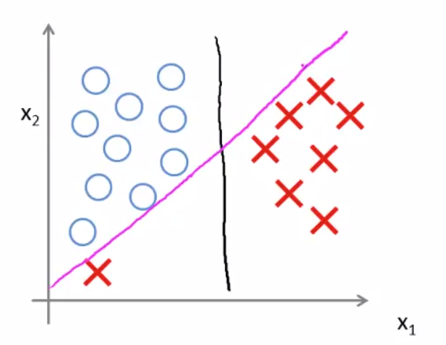

There is one way to control this - the regularization parameter, 'C'. 
 - If C is very large, it will change the decision boundary from black to pink. 
 - If C is very small, decision boundary remains at black.

Remember that C is basically 1/lambda. So large lambda = small C and vice versa.

