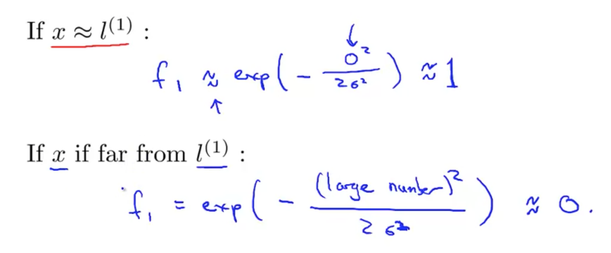

# Kernels 1

When faced with non-linear decision boundary, we can use more complex polynomial. And then you end up with a hypothesis X that:
   - predicts1, if you know that sum(theta * x) > 0
   - predict 0, otherwise.

## A) Features

To introduce a level of new notation that I'll use later, is that we can think of a hypothesis as computing a decision boundary using the new denotation f1, f2, f3 and so on to denote these new sort of features.

The question is, **Is there a different choice of features or is there better sort of features than this high order polynomials**? 

Because you know it's not clear that this high order polynomial is what we want and high order polynomials are computationally expensive. You have to ask: **Is there a different or a better choice of the features that we can use to plug into this sort of hypothesis form?**. 

So, here is one idea for how to define new features f1, f2, f3.

## B) Landmarks

Now introducing another notation, l (for landmark). The formula is given in the slide.

The similarity function sometimes called "kernel" and "Gaussian kernel" is one type of kernel we chose: this is basically the exp(...) function.

To be specific, f1 is exp function over a summation of all x's distance to a particular l (landmark). 

## C) contours

sigma^2 controls the contour. It is more obvious on a 3D graph above. As number of sigma decreases, the mountain/tip is more narrow; and vice versa.

# Kernels 2
