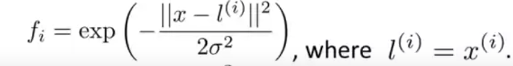
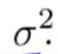
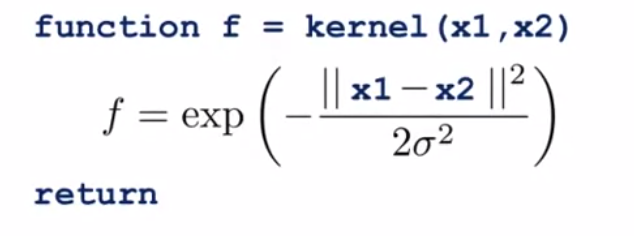
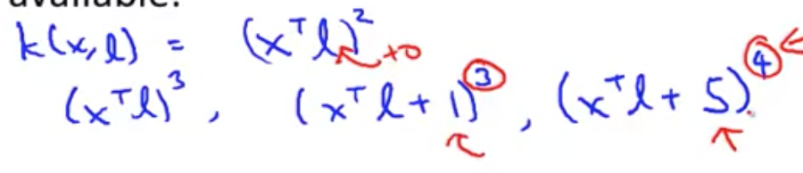

# Using an SVM

 - Use SVM software packages (eg. liblinear, libsvm, ...) to solve parameter θ; instead of solving it yourself.

 - Nonetheless, you will still need to prepare the following:
 
## 1) Choice of C
  - This is the bias/variance property (mentioned previously).

## 2) Choice of Kernel
 - Also known as the "Similarlity Function".

### a) Linear Kernel (not using kernels)
 - Linear Kernel basically means using SVM without kernel.
 - We use (θ' * x) to predict 1 or 0.
   - eg. θ[0] + θ[1]x[1] + ... + θ[n]X[n] >= 0

 - Gives you a standard linear classifier.

 - A recommended library is "linear kernel" (Yes, that's the name)

#### Motivation (Why do this?)
 - If number of features is large and training sample size is small, then you might be okay with just a linear decision boundary 
 - You risk overfitting if you try to fit a very complicated nonlinear function in a very high dimensional space.

### b) Gaussian Kernel

 - If we choose Gaussian Kernel, we will also need to choose 
  - high  == higher bias, lower variance; vice versa

#### Motivation (Why do this?)

 - When number of features is small and training size is large, 

#### Implement similarity function
 - Depending on what svm package (following rules incl. octave and matlab) you use, it may ask you to implement a kernel function, or implement the similarity function.

 - You need to write a function to compute a particular feature of the kernel.
   - specifically, it needs to take in 2 inputs and outputs 1 real number like:

   - where a vector X and landmark are represented by x1 and x2.

#### Feature Scaling
 - If you have features of very different scales, it is important to perform feature scaling before using the Gaussian Kernel to prevent a feature from overwhelming the other feature (as it might have a huge number).
 - For example, if you have 2 features: size of house (ranging from 100 to 1000) and number of bedroom (0 to 5). Then, the size of house is going to dominate the number of bedroom because the number is so much greater.
 - Doing so will make sure the svm gives a comparable amount of attention to all your different features.

### **Mercer's Theorem
  - While the most common kernels are Gaussian and Linear, there are other similarity functions.
  - However, all of them must satisfy a technical condition, known as "Mercer's Theorem". 
  - The reason you need to this is because support vector machine algorithms or implementations of the SVM have lots of clever numerical optimization tricks In order to solve for the parameter's theta efficiently 
  - What it does is all of these svm packages can use the large class of optimizations and get the parameter theta very quickly.

### c) Other Mercer's Theorem Kernels
 - Polynomial Kernels
   - Example function:

 - String Kernel (for text/string)
 - Chi-square kernel
 - Histogram intersection Kernel

# Multi-CLass Classification
 - Many SVM packages already have built-in multiclass classification functionality.
 - But incase it doesn't, one way to do this is to use the **one versus all method** that we talked about when we are developing logistic regression.
 - First, train k SVM's if you have k classes - one to distinguish each of the classes from the rest. 
 - This will give you k parameter vectors; theta i, to distinguish class i.

# Logistic Regression vs SVM

## Scenarios
- let n = number of features

- let m = number of training set data

1. if n is large relative to m, use logistic regression.
   - Because if you have so many features for a small training set, a linear function should do the job.

2. if n is small (1-1000) and m is intermediate(10-50000), use SVM with linear kernel.

3. if n is small (1-1000) but m is very very large (50000 to millions/trillions),
    - the problem is the SVM of the Gaussian Kernel will be somewhat slow to run, thus it is not advised to use on training set of size 50,000+.
    - The solution is to manually create/add features and use logistic regression, or SVM without kernel.

## Concluding Thoughts

- Logistic regression and SVM without kernel are very similar actually. If one works, the other is very likley to work.

- But along with the power of the SVM is when you use **different kernels to learn complex nonlinear functions**. And this regime, you know, when you have maybe up to 10,000 up to, maybe up to 50,000.

- That is where a svm with a kernel  will shine, because you can do things that are much harder to do that will need logistic regression. 

# How about Neural Networks? How does NN compare to svm?
 - In all scenarios mentioned, a well designed neural network is likely to work well.
 - However, the neural network might be slow to train. 
 - Whereas, if you have a very good SVM implementation package, it could run faster than neural network.

# svm - convex problem
 - It turns out that the optimization problem that the SVM has is a convex optimization problem
 - so the good SVM optimization software packages will always find the global minimum or something close to it. (Don't need to worry about local optima.)
 - In practice local optima aren't a huge problem for neural networks.

# Conclusion
When I face a machine learning problem, sometimes it's actually  not clear what is the best algorithm to us.
The algorithm does matter, but what often matters even more is things like:
 - How much data do you have? 
 - How skilled are you?
 - How good are you at doing error analysis and debugging learning algorithms?
 - Figuring out how to design new features and figuring out what other features to give you learning algorithms, and so on. 
 
Often those things will matter more than whether you are using logistic regression or an SVM. But having said that, the SVM is still widely perceived as one of the most powerful learning algorithms.

