# Unsupervised Learning: Introduction

 - In supervised learning problems, we are given a set of labels to fit a hypothesis to it.
 - In contrast, in unsupervised learning problem we're given **data that does not have any labels** associated with it. 
 - We simply give this sort of unlabeled training set to an algorithm and ask the algorithm to **find some structure in the data** for us.

Below is supervised learning, where we have labels x and o, and we want to fit a hypothesis.
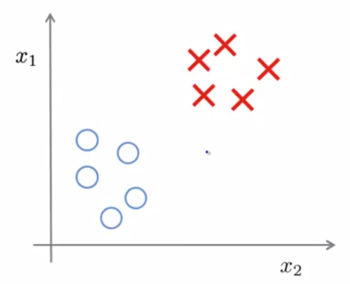

Below is unsupervised learning, where we don't have any labels.
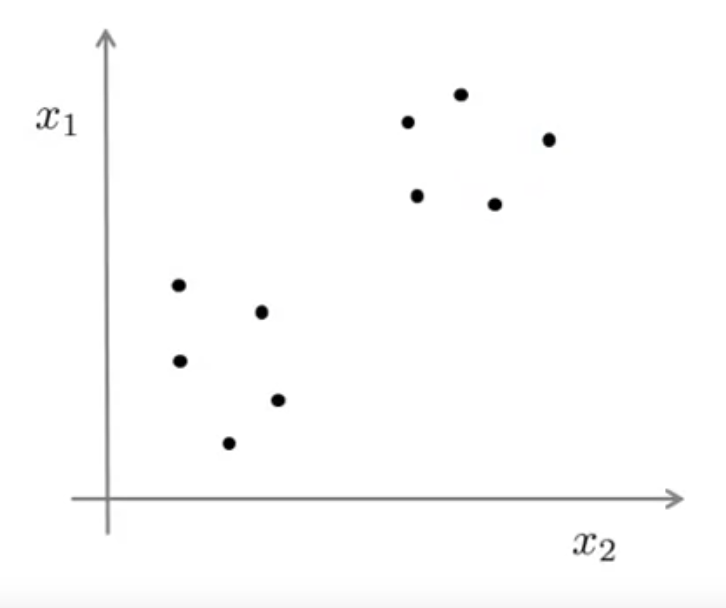

Given the data set above, since it looks like there are two seaprate clusters of points, we might have an algorithm finds clusters.

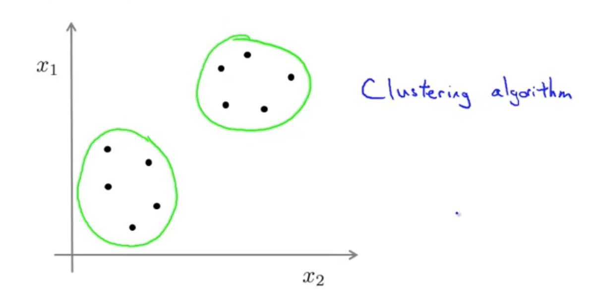

This would be our first type of unsupervised learning. There will be other types of unsupervised learning algorithms that we'll talk about later that finds other types of structure or other types of patterns in the data. 

## Applications

Early in this class I already mentioned a few applications:

1. Market Segmentation
 - where you may have a database of customers and want to group them into different marker segments so you can sell to them separately or serve your different market segments better.

 2. Social network analysis.
 - There are groups that have done things like looking at a group of people's social networks. (eg. Facebook, Google+, or maybe information about who other people that you email the most frequently and who are the people that they email the most frequently) and find coherence in groups of people.
 - This would be another maybe clustering algorithm where you know want to find who are the coherent groups of friends in the social network? 

3. Organize computer cluster.
 - Use clustering to organize computer clusters or to organize data centers better. 
 - Because if you know which computers in the data center in the cluster tend to work together, you can use that to reorganize your resources and how you layout the network and how you design your data center communications. 

4. Astronomial Data Analysis.
 - Using clustering algorithms to understand galaxy formation and using that to understand astronomical data.
 
# K-means algorithm
 - The K Means algorithm is by far the most popular and widely used clustering algorithm.

## Informal Steps
1. Below is a graph of our unlabled data.

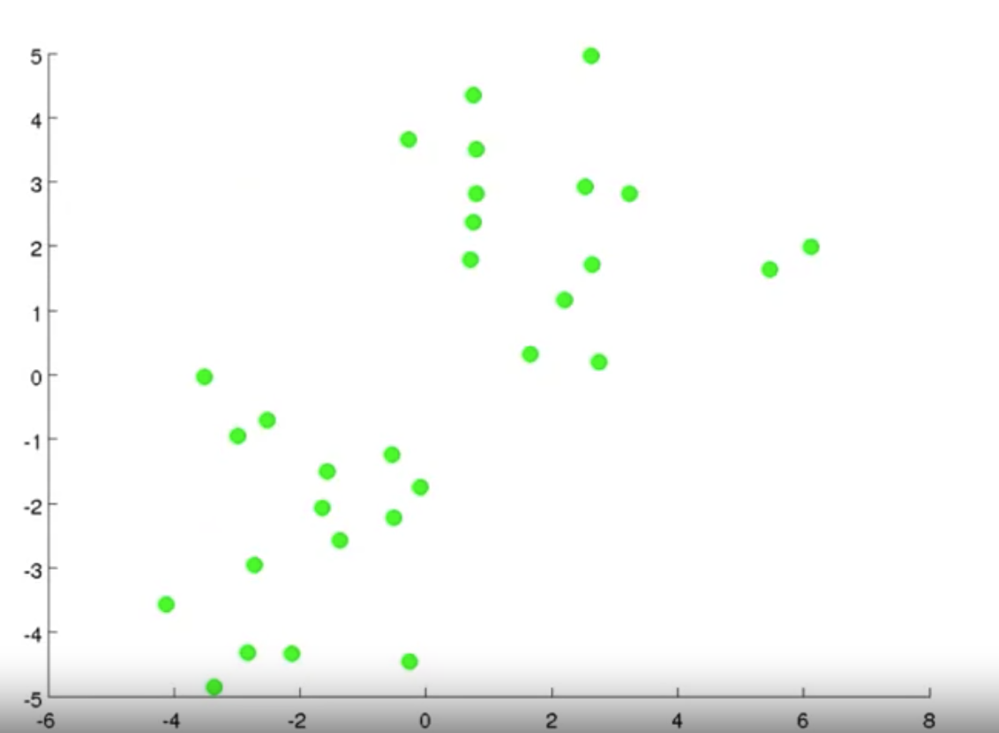

2. Randomly initialize two points, called the "cluster centroids". 
    - as shown by the two crosses in image below.
    - I have two of them because I want to group my data into two clusters.

 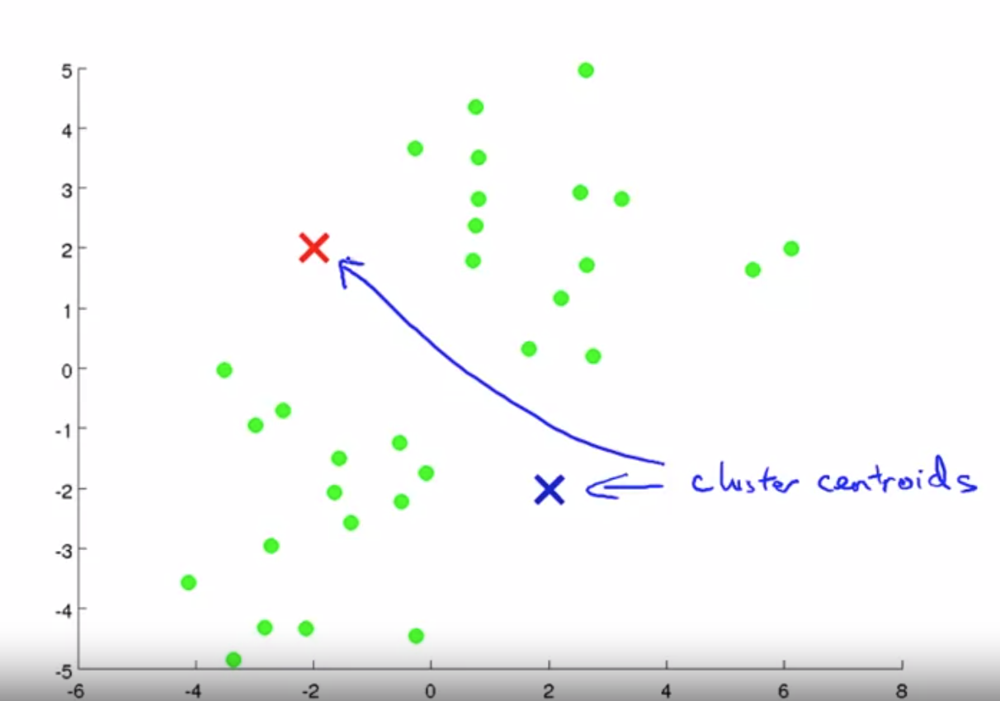

3. Then there are 2 iterative steps:

4. Cluster Assignment Step

    - Going through each of the data points (the green dots) and depending on whether it's closer to the red cluster centroid or the blue cluster centroid, it is going to assign each of the data points to one of the two cluster centroids.

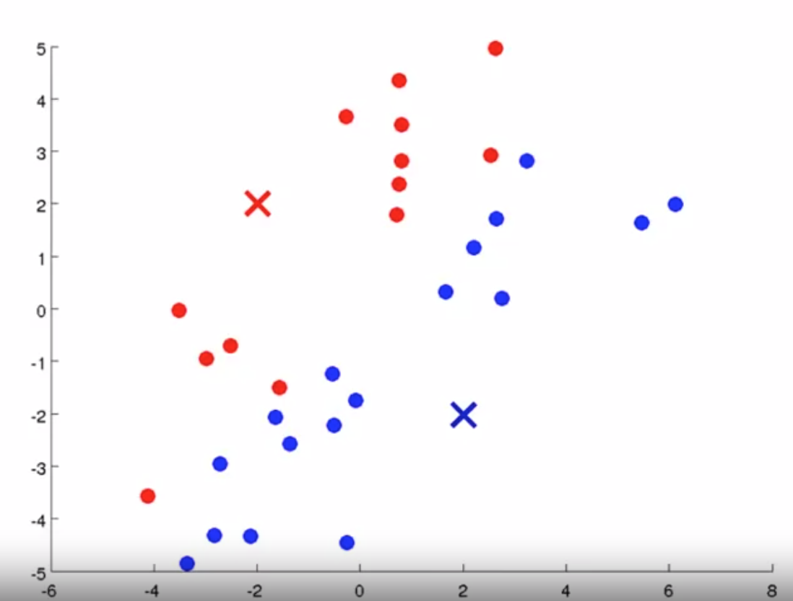

5. Move Centroid Step
    - We are going to take the two cluster centroids, that is, the red cross and the blue cross, and move them to the average of the points colored the same colour. 
    - We look at all the red points and compute the average (the mean of the location of all the red points,) and move the red cluster centroid there. And the same things for the blue cluster centroid.
    - The red and blue cluster centroid moved. 

6. And then we repeat the Cluster Assignment and Move Centroid Step.
    - In fact, at some point, if you keep running additional iterations of K means, the cluster centroids and the colours of the points will not change any further. 
    - This is when we say K means has converged.

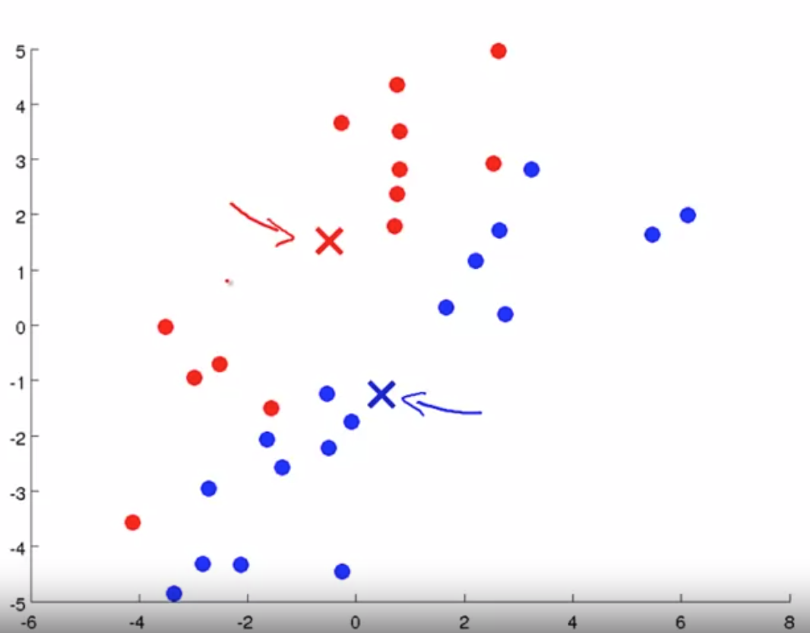

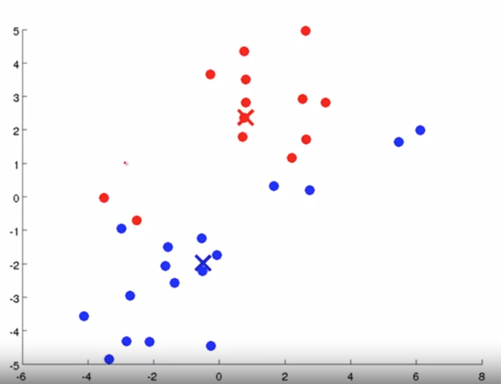

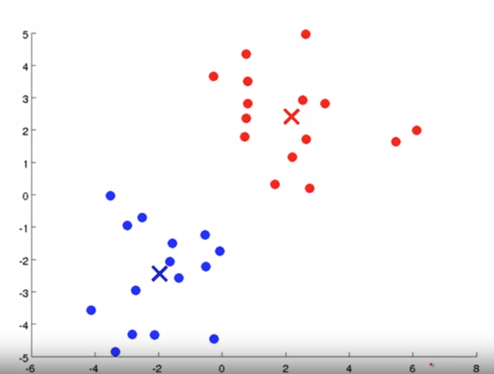

## Formal Definition
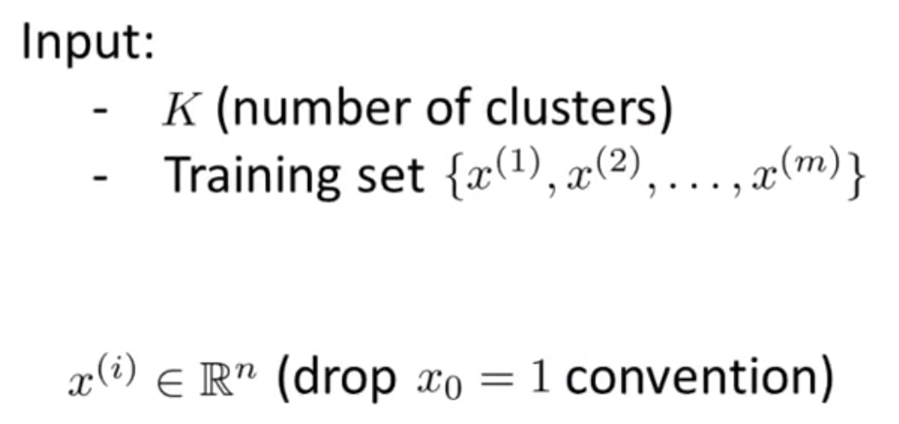

The K means algorithm takes two inputs:

1. Parameter K, which is the number of clusters you want to find in the data. 
    - I'll later say how we might go about trying to choose k

2. Unlabeled traininset of Xs.
    - And for unsupervised learning of the K means, I'm going to use the convention that Xi is an R^N dimensional vector. 
    - that's why my training examples are now N dimensional rather N plus one dimensional vectors. (??)

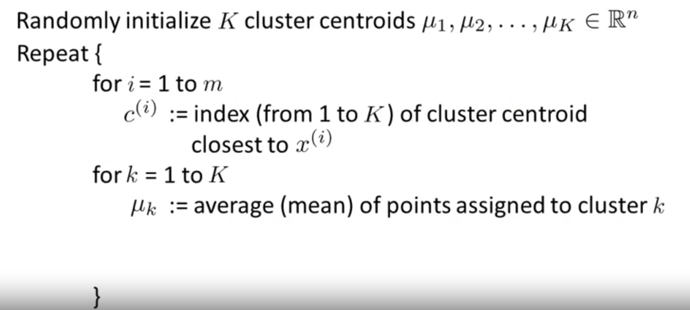

For the Cluster assignment step, we use 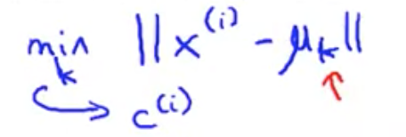 to find the "cluster centroid closest to x(i)

# Optimization Objective

Here, we define the optimization objectives. The reason we need to know is:

1. Knowing what is the optimization objective of k-means will help us to **debug** the learning algorithm and just make sure that k-means is running correctly. 
2. In a later video we'll talk about how we can use this to help k-means **find better costs** for this and **avoid the local ultima**. 

Some notations to be aware of:
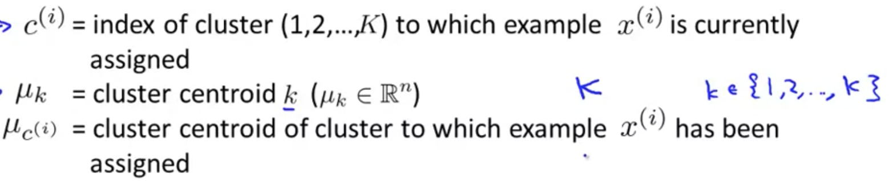

1. c^(i) keeps track of the index or the number of the cluster for example x^i
2. μ_k is the location of cluster centroid k. 
    - Note that capital K is used to denote the total number of clusters. Here, lower case k is going to be an index into the cluster centroids.
3. μ_(c^i) is used to denote the cluster centroid of the cluster to which example xi has been assigned,
    - Lets assume xi has been assigned to cluster number five. So, x^i -assigned-> 5, c^i = 5. 
    - Therefore, μ_(c^i) = μ_5

## Cost Function

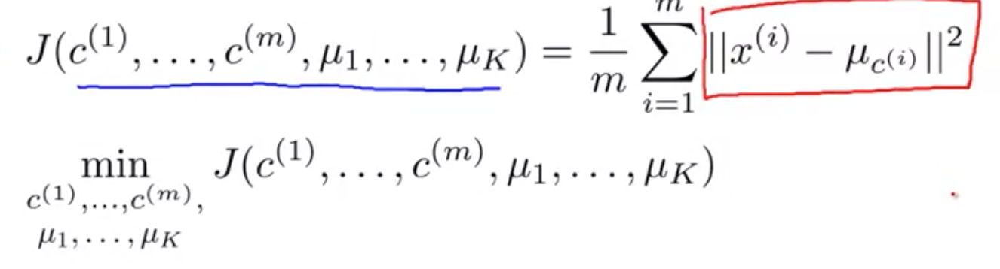

 - The cost function that k-means is minimizing is a function J of all of these parameters, c^1 through c^m and μ_1 through μ_K. 

 - To the right is the average of **square distance** between each example x^i and the location of the cluster centroid to which x^i has been assigned. 

 - The goal is to try to **find c and μ** that can minimize this cost function J - this cost function is sometimes also called the **distortion function**.

 - We can use the distortion function to debug k-means and help make sure that k-means is converging and running properly.

## Details
There are actually 2 steps:

1. In the Cluster Assignment step, we are trying to minimize J, with respect to the variables c^1, c^2, up to c^m, **while holding the cluster centroids μ_1 up to μ_K fixed**.

2. In the Move Centroid step, we choose the values of μ that minimizes J with respect to the locations of the cluster centroids μ_1 through μ_K.

# Random Initialization

 - Here, I'd like to talk about:
    - how to initialize K-means 
    - how to make K-means avoid local optima. 
 - There are few different ways that one can imagine using to randomly initialize the cluster centroids. But, it turns out that there is one method that is much more recommended than most of the other options one might think about.

## Some Starting Points

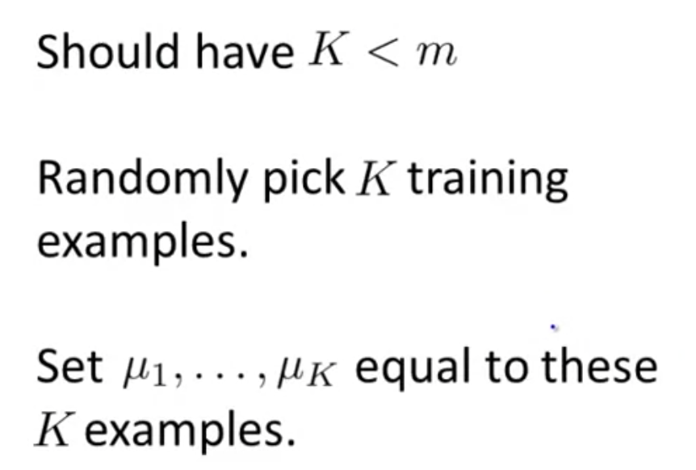

1. When running K-means, you should have the number of cluster centroids (K) < the number of training examples M.
    - It would be really weird to run K-means with a number of cluster centroids that's equal or greater than the number of examples you have!

2. The way I usually initialize K-means is, I would randomly pick k training examples. And then set μ_1 of μ_K equal to these k examples.

## Local Optima Problem

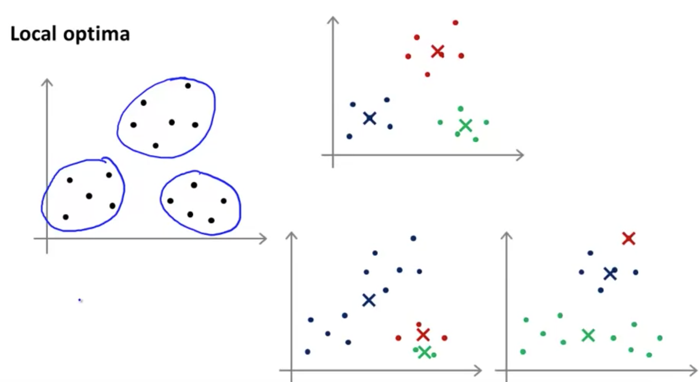

 - Image above demonstrates how you might end up with local optima.
 - On the left is a graph with our dataset (circle to denote the ideal result).
 - On the right are 3 possible k-means result. The bottom 2 are examples of stuck in local optima, as this is not the ideal clustering.

## Fixing Local Optima problem

The idea is to **try multiple random initializations** and **find the best solution** we can find (to hopefully escape local optima).
 - best solution is defined by the least cost (distortion)

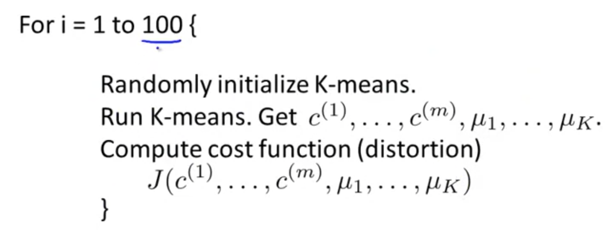

Concretely, here's how you could go about doing that:
 - Let's say, I decide to run K-means a hundred times so I'll execute this loop 100 times (or any number of times).
 - For each of these 100 random intializations, we would run K-means, get a set of clusterings, get a set of cluster centroids, and then compute the cost function (distortion) J.
 - Having done this whole procedure a 100 times. You will have 100 different ways of clustering the data.
 - Then of these 100 ways, pick one that gives us the lowest cost (or lowest distortion). 

## Works better for small number of clusters
 - It turns out that if you are running K-means with a fairly small number of clusters (2 to 10) then doing multiple random initializations can often make sure that you find a better local optima. 
 - If K is much greater than 10 (eg. 100+), then having multiple random initializations is less likely to make a huge difference and there is a much higher chance that your first random initialization will give you a pretty decent solution already.

# Choosing the number of clusters
Here, let's talk about how to choose the number of clusters, or the value of the parameter, K.

 - To be honest, there actually isn't a great way of answering this or doing this automatically. By far the most common way of choosing the number of clusters is choosing it manually by:
    - looking at visualizations, or
    - looking at the output of the clustering algorithm, or
    - something else.

 - The **most common** thing is actually to choose the number of **clusters by hand**.
 - A large part of why it might not always be easy to choose the number of clusters is that it is often **generally ambiguous how many clusters there are** in the data.

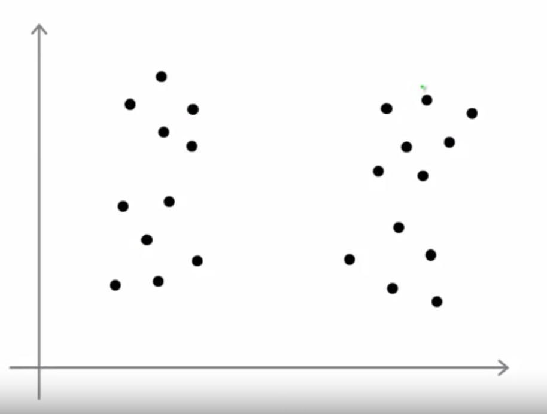

 - Looking at this data set above, some of you may see 4 clusters. Or some may see 2 clusters.

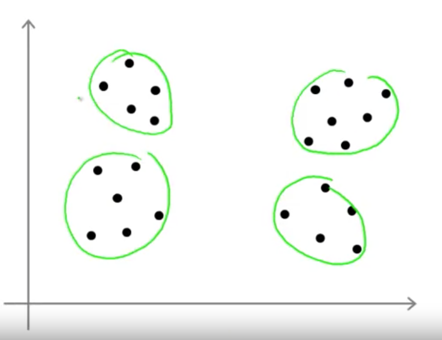

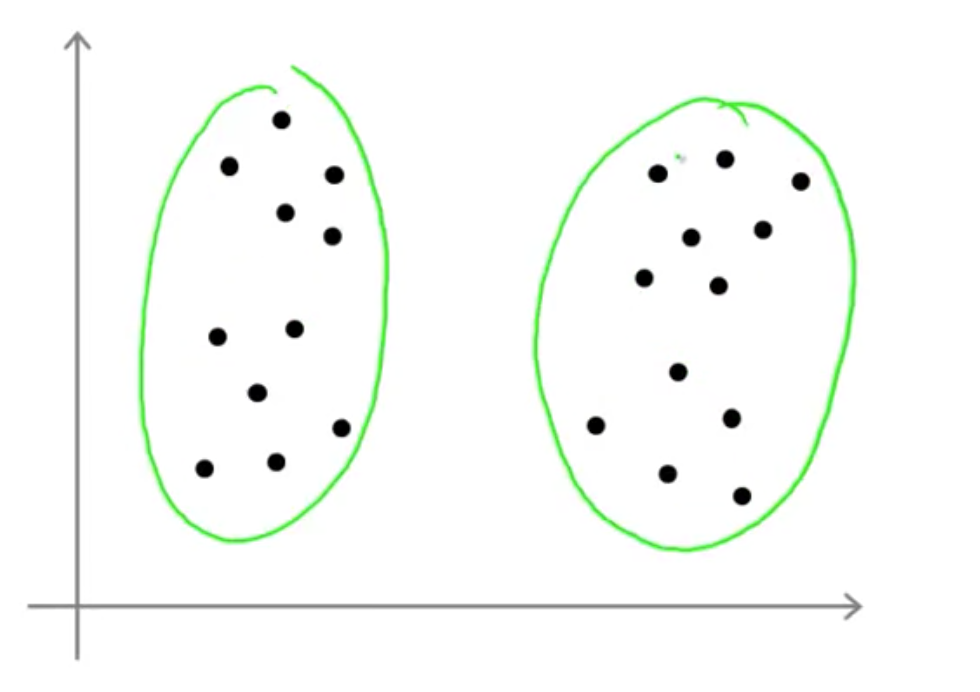

 - Looking at the data set like this, the true number of clusters seems genuinely ambiguous; I don't think there is one right answer. 
 - This is part of our supervised learning. We are aren't given labels, and so there isn't always a clear cut answer.
 - This is one of the things that makes it more difficult to have an automatic algorithm for choosing how many clusters to have.

## Elbow Method
When people talk about ways of choosing the number of clusters, one method that people sometimes talk about is the "Elbow Method".

 - In elbow method, we're going to run K-means with one cluster and compute the cost function (or distortion) J and plot that in graph below.
 - Then, we repeat with 2 clusters up to some number of clusters. 
 - We end up with a curve showing how the distortion goes down as we increase the number of clusters.

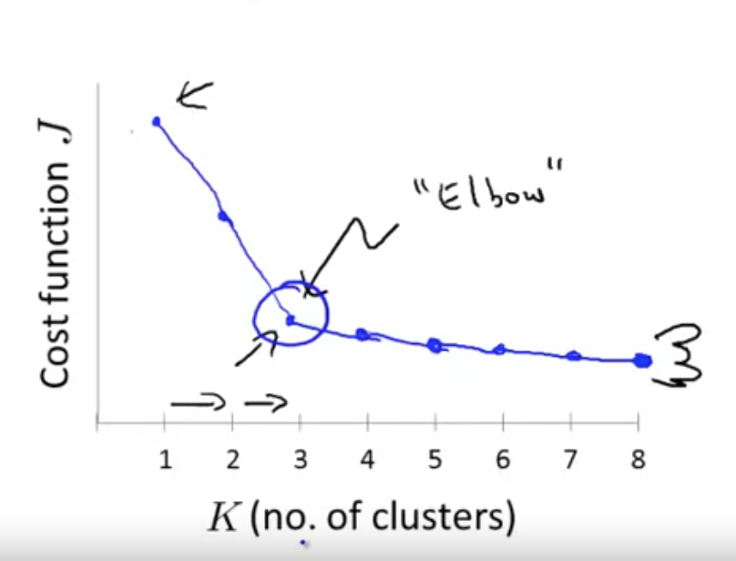

 -  And if you look at this curve, it looks like there's a clear elbow there. You find this sort of pattern where:
    1. The distortion goes down rapidly from 1 to 3.
    2. Reach an elbow at 3
    3. The distortion goes down very slowly after that. 
 
 - From this it looks like maybe using 3 clusters is the right number of clusters, because that's the elbow of this curve, right? 

 - If you apply the Elbow Method, and you get a plot that actually looks like this, then that's pretty good, and this would be a reasonable way of choosing the number of clusters.

 - But, it turns out the Elbow Method isn't used that often, because if you actually use this on a clustering problem, it turns out that, **fairly often, you end up with a curve that looks much more ambiguous**, something like this:

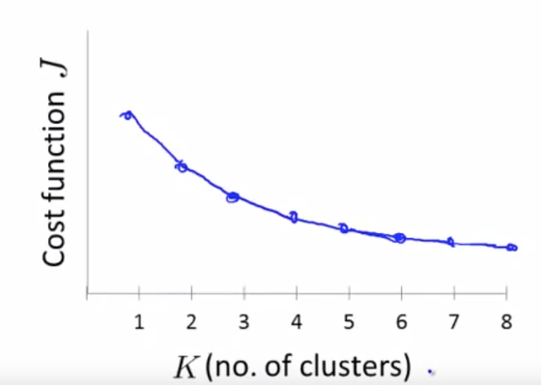

 - If you look at this, there's no clear elbow - it looks like distortion continuously goes down.

 - Conclusion is Elbow Method is worth the shot but I wouldn't necessarily have a very high expectation of it working for any particular problem.

## T-shirt example
Finally, here's one other way of thinking about how you choose the value of K.
 - Very often, people are running K-means in order to get clusters for some later purpose, or downstream purpose. 
 - Maybe you want to use K-means in order to do **market segmentation**, like T-shirt sizing. 
 - If that gives you an evaluation metric, then often, a better way to determine the number of clusters, is to see how well different numbers of clusters serve that later downstream purpose.

### Example
Let me go through the T-shirt size example again - I'm trying to decide, do I want 3 or 5 T-shirt sizes? 

1. Choose K equals 3, which gives me small, medium and large T-shirts. 

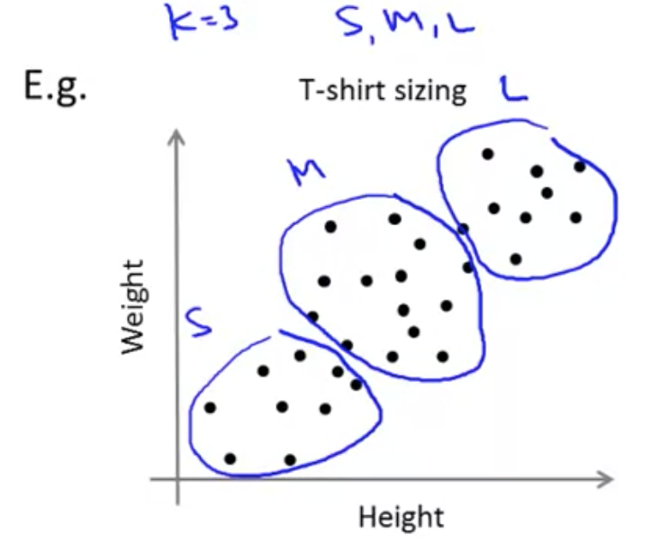

2. Choose K equals 5, which gives me extra small, small, medium, large and extra large T-shirt sizes. 

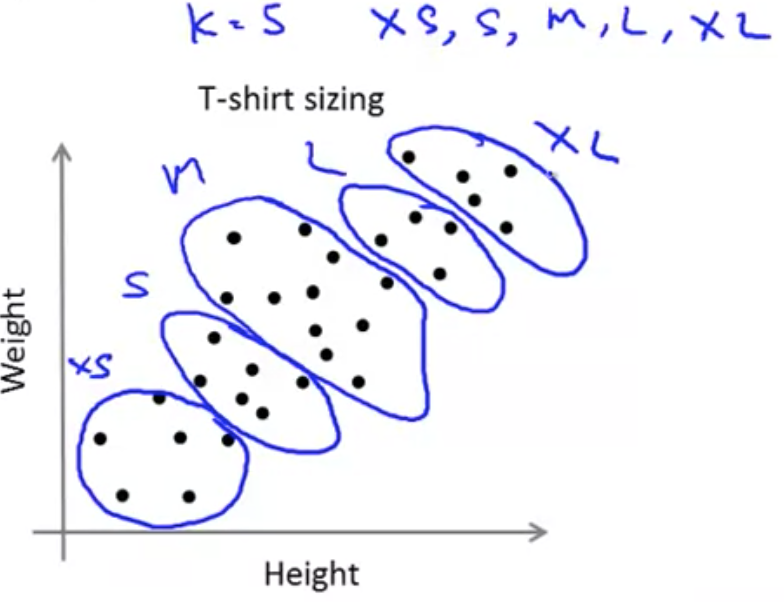

 - The nice thing about this example is you can do is think about this from the perspective of the T-shirt business and ask: "Well if I have five segments, then how well will my T-shirts fit my customers? how many T-shirts can I sell? How happy will my customers be?" 
 - What really makes sense, from the perspective of the T-shirt business, is whether:
    - I want to have T-shirt sizes so that my T-shirts fit my customers better? 
    - Or do I want to have fewer T-shirt sizes so that I make fewer sizes of T-shirts and I can sell them to the customers more cheaply?

## Conclusion

 - To summarize, for the most part, the number of customers K is still **chosen by hand** by human input or human insight. 
 - One way to try to do so is to use the Elbow Method, but I wouldn't always expect too much.
 - I think the better way to think about how to choose the number of clusters is to ask, **for what purpose are you running K-means?**
 - And then think - what is the number of clusters K that serves that purpose?
