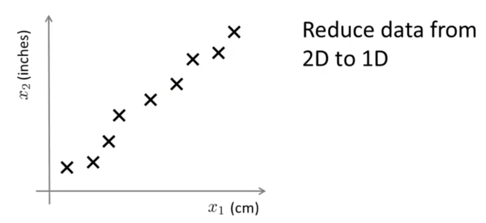
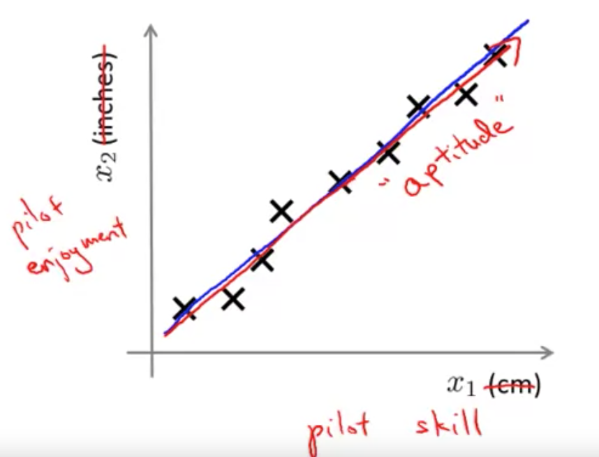
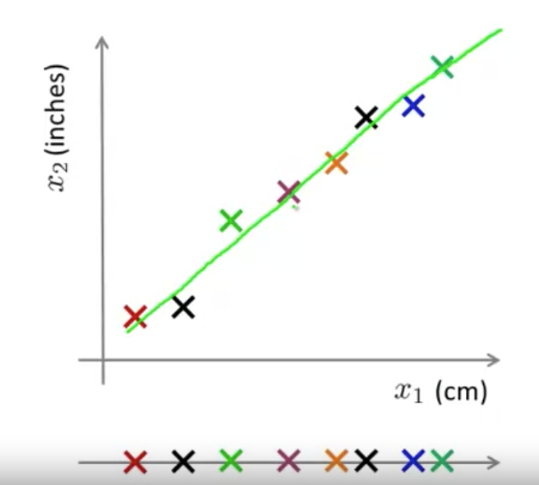
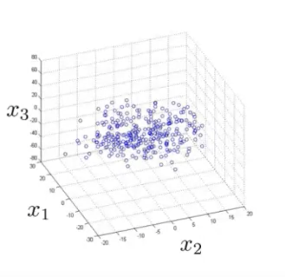
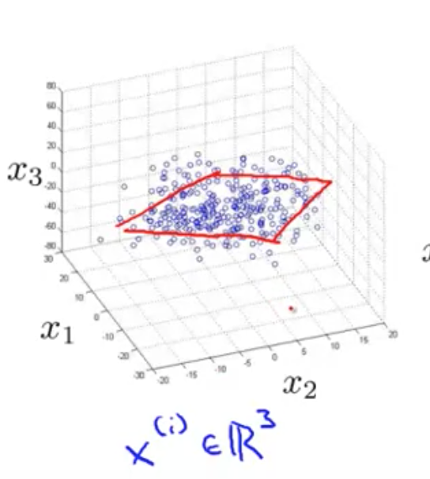
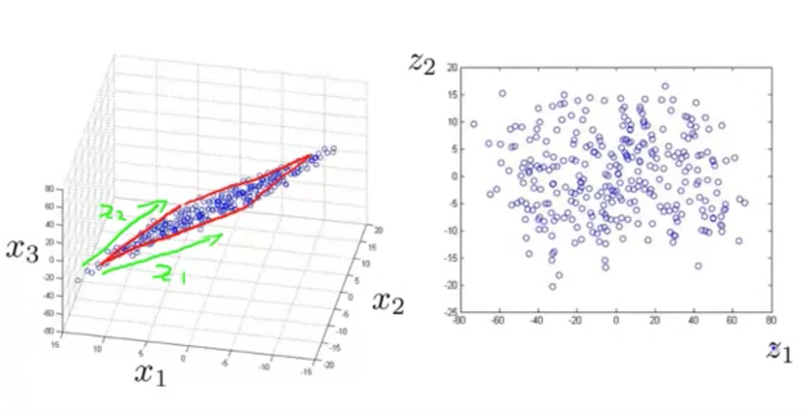
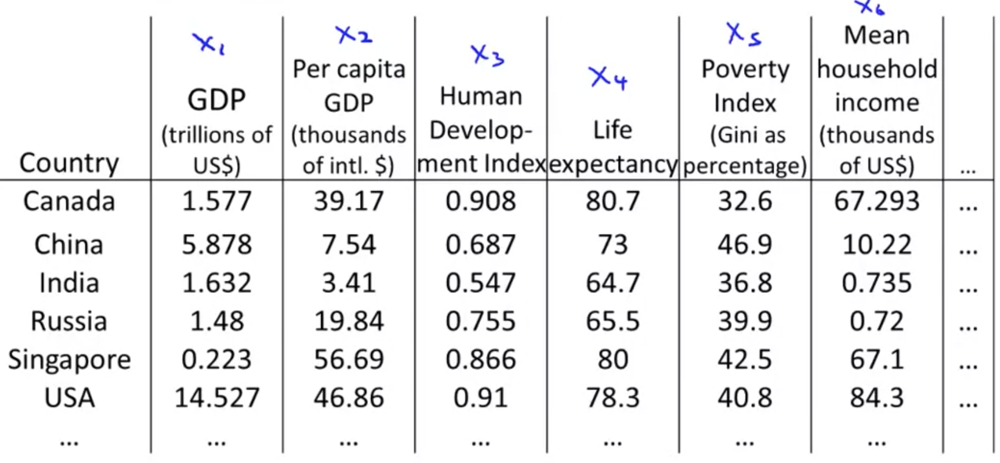
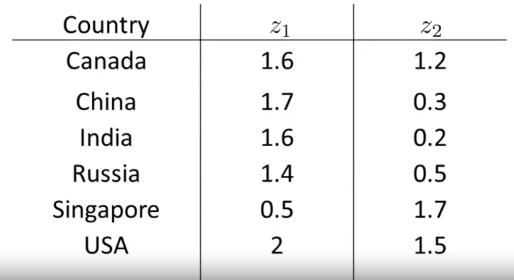
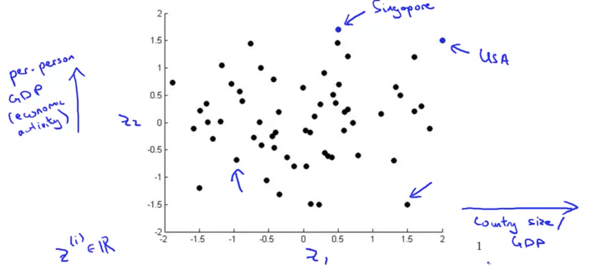

# Motivation I: Data Compression

Here, I'd like to start talking about a second type of unsupervised learning problem called **dimensionality reduction**.

There are a couple reasons why one might want to do dimensionality reduction:
1. Data Compression
 - data compression allows us to use up **less computer memory or disk space**
 - and also allow us to **speed up our learning algorithms**.

Using the graph above, we want to do is reduce the data to one-dimensional and have only one number measuring this length. 

This example seems a bit contrived, but it is actually not that unrealistic; not that different from things in industry.

If you have hundreds or thousands of features, it is often easy to lose track of exactly what features you have. 
Sometimes, you may have a few different engineering teams, maybe one engineering team gives you some features, a second engineering team gives you another some more features, and you end up with a thousand features.
Due to the large number of features, it becomes hard to keep track of redundant features.

For example, you would expect the dataset to lie exactly on a straight line (but it is not). This is because of round-off error to the nearest centimeter or inch.
If we can reduce the data to one dimension instead of two dimensions, that reduces the redundancy.

If you were to do a survey and have one feature, "x1"(the skill of some helicopter pilots), and "x2" (pilot enjoyment), you might find a correlation.
What you really care about is the direction (or hypothesis) which is really a different feature that we will call pilot aptitude for now.

## Reducing data from 2D to 1D

Using example above, to reduce data from 2d to 1d:

1. We use the direction (denoted by green line) that most of the data seems to lie and project all the data onto that line.
2. By doing so, I can measure the position of each of the examples on that line. And come up with a new feature, z1 (1d data, denoted by 1d line below).
3. To specify the position on the line I need only one number that specifies the location of each of those points on this green line.
   - each data point is colored corresponding to 2d and 1d version of it.

Just to summarize, if we allow ourselves to approximate the original data set by projecting all of my original examples onto the green line, then I need only one real number to specify the position of a point on the line.

This halves the memory/space requirement and makes our algorithm much faster.

## Reducing data from 3D to 2D

Next, I'm going to show another example of reducing data from 3D to 2D.

By the way, in the more typical example of dimensionality reduction, we might have a 1000-dimensional data and reduce it to 100-dimensional. But because of the limitations of what I can plot on the slide, I'm going to use examples of 3D to 2D.

Using above graph as example, it might be hard to that all of this data lies roughly on the plane.

What we can do with dimensionality reduction is take all of this data and project the data down onto a 2D plane.

Finally, in order to specify the location of a point within a plane, we need two numbers. Let's call it z1 and z2 in order to specify the location of a point within a plane. Now, we can now represent each training example using the two numbers, z1, and z2.

# Motivation II: Visualization

Let's say we've collected a large data set of many statistics and facts about different countries around the world.

We may have a huge data set like this, where there are 50 features for every country, and we have a huge set of countries.

Is there something we can do to try to understand our data better? 
If you have 50 features, it's very difficult to plot 50-dimensional data. How can we visualize this data? 

Using dimensionality reduction, what we can do is, instead of having each country represented by featured vector, x_i (which is 50-dimensional), we can come up with a different feature representation, z_1 and z_2.

If you plot these features, you might find that the horizontial axis(z_1) corresponds roughly to the overall country size, or the overall economic activity of a country. Whereas, the vertical axis in our data might correspond to the per person GDP.

You might find that the axes z_1 and z_2 can help you to capture the two main dimensions of the variations amongst different countries, such as the overall economic activity of the country projected by the size of the country's overall economy, as well as the per-person individual well-being, measured by per-person GDP, per-person healthcare, and things like that.

That's how you can use dimensionality reduction, in order to reduce data from 50-dimensions to 2-dimensions, and plot it to understand your data better.

