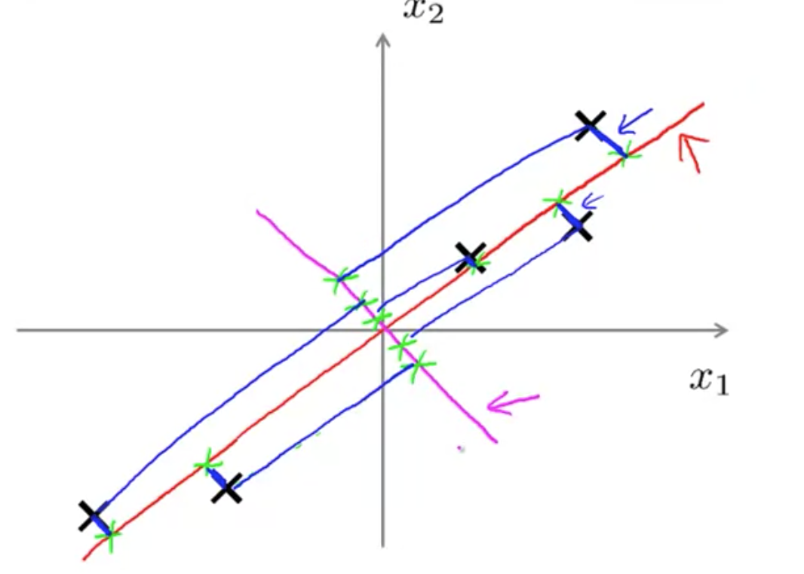
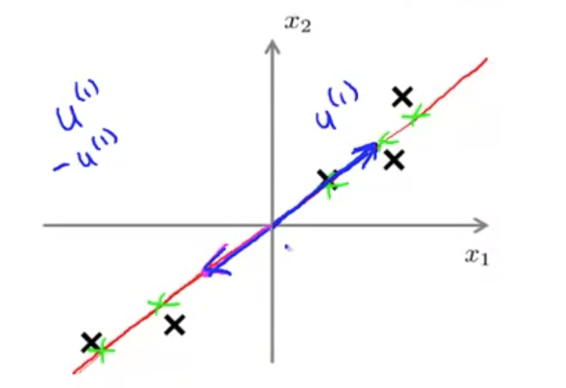

# Principal Component Analysis Problem Formulation

For the problem of dimensionality reduction, the most popular algorithm is "principle components analysis" (or PCA). 

Here, I will talk about the problem formulation for PCA. In other words, let's try to formulate, exactly what we would like PCA to do. 
Let's say we have a data set like this. 

So, this is a dataset of examples x_1 and x_2.
Let's say I want to reduce the dimension of the data from 2-dimensional to 1-dimensional. 
In other words, I would like to find a line to project the data. 

It seems like the red line above is a good line to project the data.

The reason we think this might be a good choice is that if you look at where the projected versions of the point scales, we find that the distance between each point and the projected version is pretty small (denoted by blue lines)

The length of those blue line segments are basically the euclean distance from a point to the red line. These are sometimes called the **"projection error"**. 
**PCA tries to find a surface (or line if 2d to 1d) to project the data such that it minimizes the projection error.**

Before applying PCA, it's **standard practice to first perform mean normalization and feature scaling** so that the features x1 and x2 have zero mean, and should have comparable ranges of values. (This will be expanded later)

In contrast to the red line, here's a different line (magenta line) onto which I could project my data. 
As you can see, this magenta line is a much worse direction onto which to project my data.

This is more clear when we draw the projection errors (They are huge)
That's why PCA (principal components analysis) will choose something like the red line, rather than the magenta line.

## Goal of PCA

Here, the goal of PCA is to reduce data from 2-dimensional to 1-dimensional.
We're going to try find a vector (u1) to minimize projection error.

Since it's a vector, it doesn't matter if u1 is positive or negative (u1 = -u1)

Above is a 3d to 2d example, where the vectors chosen are u1 and u2. 

If you're not familiar with linear algebra, **think of it as finding k directions, instead of just one direction, to project the data.**

## PCA is not linear regression

Despite cosmetic similarities, PCA is not the same as linear regression.

In picture above, the left is an example of linear regression. In linear regression, we're trying to predict the value of some variable (y) given some info features(x). We're trying to fit a straight line to minimize the square error between point and this straight line. Notice that I'm drawing these **blue lines vertically**. 

In contrast, in PCA, we try to **minimize the magnitude of these blue lines**, which are drawn at an angle. These are the shortest orthogonal distances between the point x and this red line.

This gives very different effects depending on the dataset. 

When you're doing linear regression, there is this distinguished variable(y) that we're trying to predict. Whereas in PCA, there is no distinguish variable(y) that we're trying to predict. Instead, we have a list of features (x1, x2, ...xn) and all of these features are treated equally.

# Principal Component Analysis Algorithm

Before applying PCA, there is a data pre-processing step, which you should always do. It is important to always perform mean normalization, and then depending on your data, maybe perform feature scaling as well.

## Data Preprocessing

This is very similar to the mean normalization and feature scaling process in supervised learning. 

In fact it's exactly the same procedure except that we're doing it now to our unlabeled data, X1 through Xm. 

### Mean Normalization (First box under pre-processing)
In the mean normalization step, first, we compute the mean of each feature and then we replace each feature (x) with x_i - mean.
This makes each feature now have exactly zero mean.

The different features have very different scales. So for example, if x1 is the size of a house, and x2 is the number of bedrooms, to use our earlier example, we then also scale each feature to have a comparable range of values. And so, similar to what we had with supervised learning, we would take x, i substitute j, that's the j feature

### Feature Scaling (Second box under pre-processing)

After mean normalization, we divide it by s_j. Here, s_j is some measure of the beta values of feature(j). 
It could be the max minus min value, or more commonly, the standard deviation of feature j. 

## Applying PCA

### 1) Calculating Covariance Matrix

To apply pca, first, we compute something called the covariance matrix. The covariance matrix is commonly denoted by this Greek alphabet which is the capital Greek alphabet sigma (shown above). Note that the Greek alphabet sigma looks exactly like the summation symbol.

### 2) Eigenvectors of Matrix Sigma

Then, we need to do is compute something called the **eigenvectors of the matrix sigma**. In octave, you can do this via the svd method, which stands for **singular value decomposition**.

This is a much more advanced linear algebra than you actually need to know.

It turns out that when Sigma is equal to covariance matrix, there are a few ways to compute these vectors. If you are an expert in linear algebra and if you've heard of high in vectors before, you may know that there is another octet function called I, which can also be used to compute the same thing. However, the SVD is more numerically stable. So I tend to use SVD. 

SVD and I works the same on the covariance matrix because they satisfy a mathematical Property called **symmetric positive**, which You really don't need to know what that means. 
 - Note that the SVD and I-functions are different functions, but when they are applied to a covariance matrix, they result in teh same thing.

If you're implementing this in a different language than Octave or MATLAB, you should find the numerical linear algebra library that can compute the SVD or singular value decomposition; there are many libraries esp for the major programming languages. 

### 3) Choosing k dimensions 

The SVD outputs three matrices: u, s, and v. The thing you really need out of them is the u matrix.

The **u matrix will also be a NxN matrix**.

If we look at the columns of the U matrix, it turns out that the **columns of the U matrix is exactly the direction vectors, u1, u2 and so on**.

Since we want to reduce the data from n dimensions down to k dimensions, then we just need to **take the first k vectors that gives us u_1 up to u_K**. For now, let's call this matrix the **Ureduce matrix**.

### 4) Compute z

Next, we **compute Z by letting Z equal to the Ureduce matrix transpose times X**. 
