# Reconstruction from Compressed Representation

Previously, we talked about pca's compression algorithm. Therefore, there should be a way to go back from this **compressed representation back to an approximation of your original high-dimensional data**.

So given z_i (which may be 100-dimensional), how do you go back to your original representation, x_i (which was maybe a 1000-dimensional)?

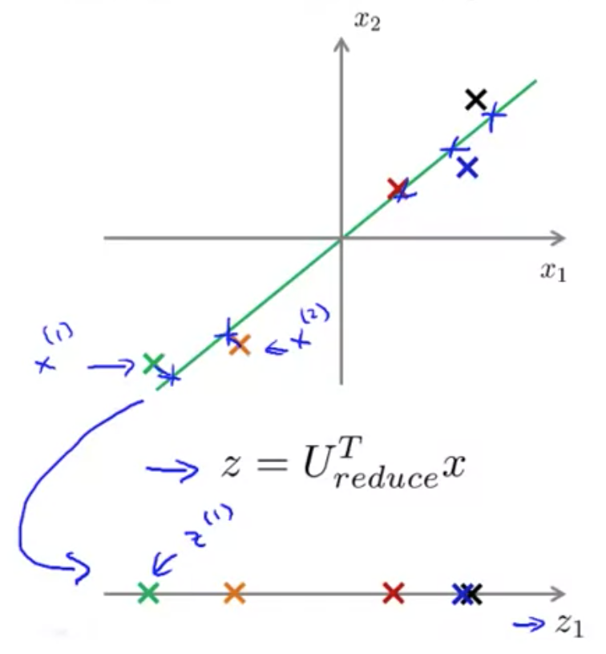

In the PCA algorithm, we may have an example like this. Given the point z1, how can we go back to this original two dimensional space? In particular, given the point z, which is R, can we map this back to some approximate representation x and R^2 of whatever the original value of the data was? 
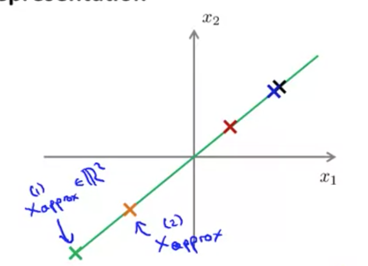

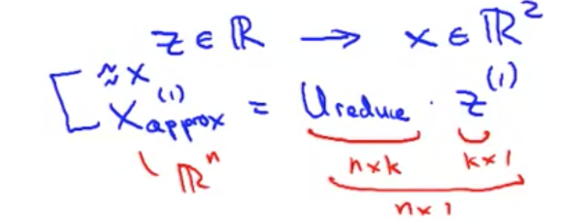

 - **Assume z = Ureduce' * X**
 - If you want to go in the **opposite direction**, the equation for that is:
   - **X_approx^(i) = Ureduce * z^(i)**

# Choosing the Number of Principal Components

In the PCA algorithm, we take N dimensional features and reduce them to some K dimensional feature representation. This **number K** is a parameter of the PCA algorithm, which is also called the **number of principle components** (or the number of principle components that we've retained).

Here, we will talk about some guidelines in choosing this parameter K for PCA.

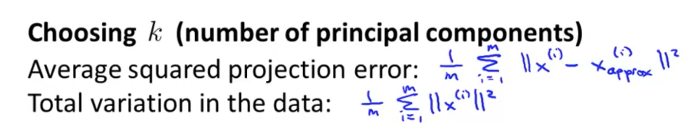

 - Average Squared Projection Error
   - Remember that PCA tries to **minimize the average squared projection error** (which is squared distance between x and it's projection onto that lower dimensional surface; algorithm for this is in picture above).
 - Total variation in the data
    - This is the average of my training sets of the length of each of my training examples. 
    - Basically, "On average, how far are my training examples from the vector, from just being all zeros?" How far is, how far on average are my training examples from the origin? 
    - (I think the reason for finding the distance from the origin is because it assumes the mean is 0 because the data should been 'centered' from mean normalization. As a result, this measures the spread from the mean.)

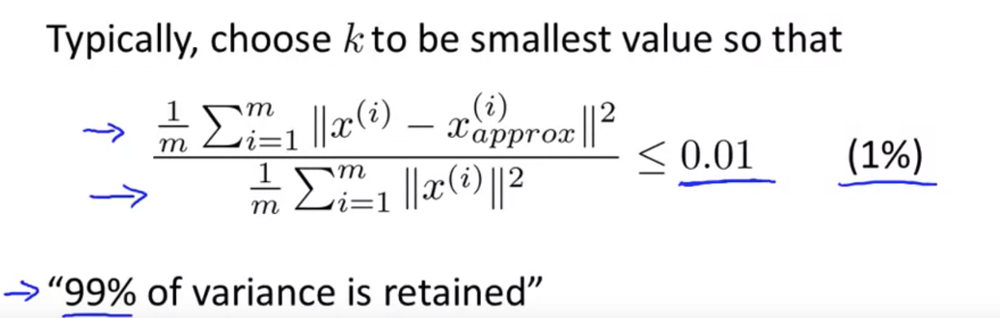

When we're trying to choose k, a pretty common rule of thumb for choosing k is to choose the smaller values so that the ratio between these is less than 0.01.

In other words, Average Squared Projection Error divided by total variation of the data gives the **average squared projection error**.
 - That is how much the data varies.

We want this ratio to be less than 1%.

Most people thinking about choosing K, rather than directly choosing K, talk about what this number is - whether it is 0.01.
**Another way to say this in the language of PCA is that 99% of the variance is retained.**

If you want to tell someone how many principle components you've retained, it would be more common to say: "I chose k so that 99% of the variance was retained". 
 - 0.01 is what people often use. But other common values is 0.05 and 0.1.

## Implementation

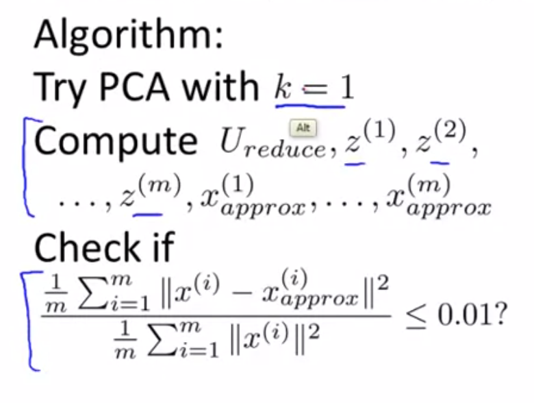

How do you implement this? Here's one algorithm that you might use. Assuming we want to achieve 99% of the variance.

1. Choose the value of k, starting with k = 1. 
2. Compute Ureduce matrix. 
   - algorithm is: 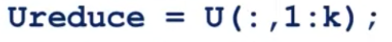
3. Compute all of the x1_approx up to xm_approx (or z_1 to z_m)
   - algorithm is: 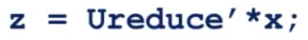
4. Check if 99% of the variance is retained.
5. If step 4 condition is not fulfilled, then we move onto k = 2 and repeat the entire process. We increment k until step 4 condition is fullfilled.  

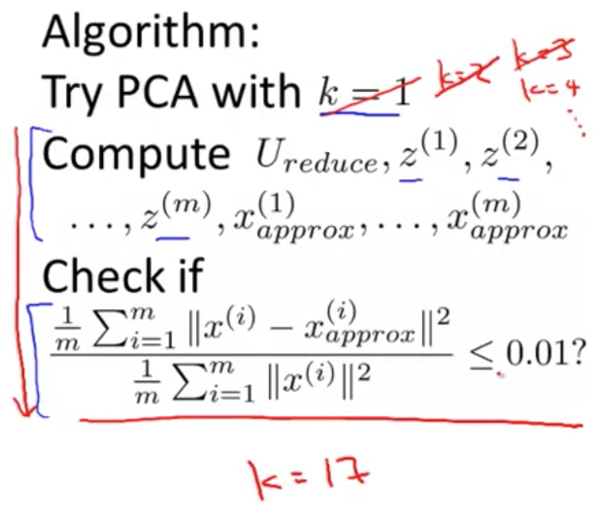

In example above, we keep trying until k = 17 fulfills thes 99% variance requirement.

## Optimizations

As you can see, this procedure seems horribly inefficient. Fortunately, when you implement PCA, it actually gives us a quantity that makes it much easier to compute these things. 

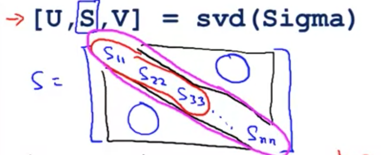

When you're calling SVD, you get the matrices U, S and D. The matrix S that you get back is a square matrix (NxN) that has diagonal entries s_11 to s_nn. The rest are all zeros.

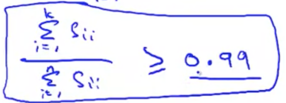

It turns out that for a given value of k, the variance retained (99%) can be computed using algorithm above.

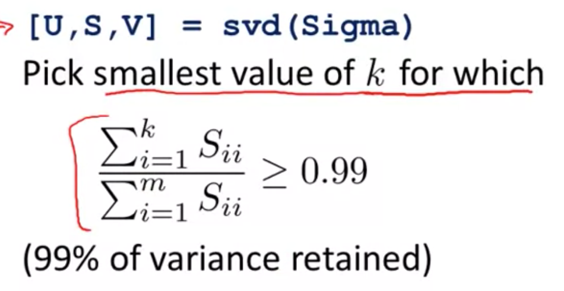

What you can do is slowly increase k, until you get 99% of the variance retained.

And if you do this, you only need to call the SVD function once. 

## Ending Note
You often find that PCA will be able to retain 99% of the variance (or some high fraction of the variance) even when compressing the data by a very large factor.

# Advice for Applying PCA

Previously, I said that PCA can be used to speed up the running time of a learning algorithm. Here, I'd like to explain how to do that, and also give some advice about how to apply PCA.

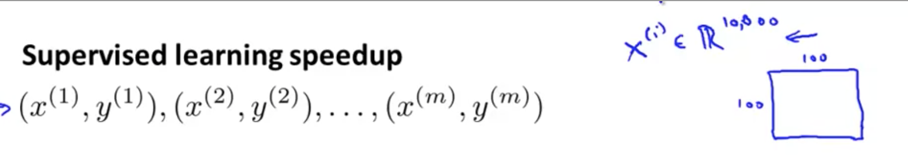

## Optimizing Supervised learning using PCA

PCA can speed up supervised learning as well. It is possible to reduce dimension by 10x and barely affect the classification accuracy of the learning algorithm (and run much faster).

Recap of previous notes, let's say you have a supervised learning problem with inputs X and labels Y, and let's say that your examples x_i are very high dimensional (10,000-dimensional).

One example of that would be if you were doing some computer vision problem, where you have a 100x100 images, which is 10,000 pixels, thus, has 10,000 dimensional feature vectors.

With very high-dimensional feature vectors like this, running a learning algorithm can be slow. Fortunately with PCA, we'll be able to reduce the dimension of this data and make our algorithms run more efficiently. 

Here's how you do that:

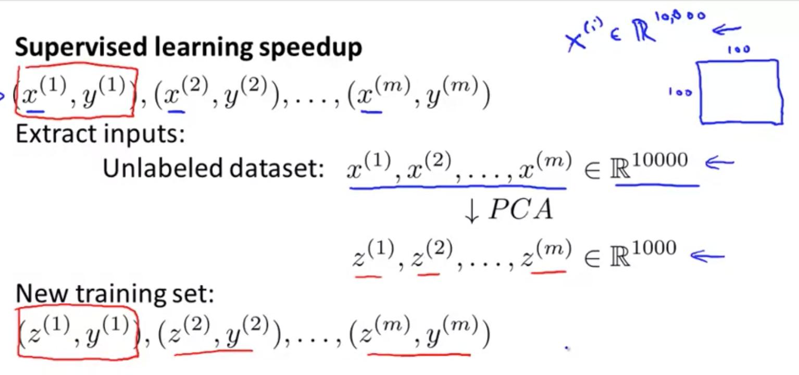

1. Check our labeled training set and extract just the inputs (just the X's); and temporarily put aside the Y's.
2. This now gives us unlabeled training set x_1 to x_m, which may be 10,000 dimensional data.
3. Apply PCA and get reduced dimensional data, z_i
4. Take this reduced dimension training set and feed it to a learning algorithm (maybe a neural network or logistic regression)

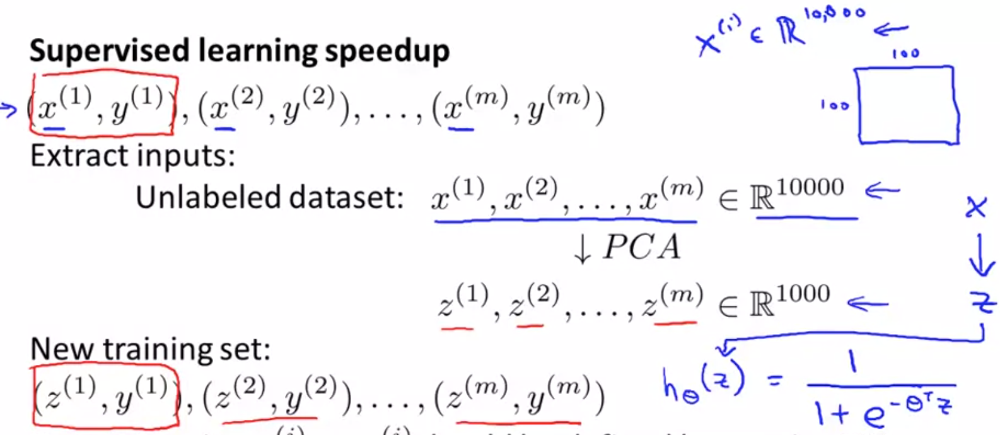

5. I can learn the hypothesis hθ(z) that takes z as input and make predictions.

6. If you have a new example, maybe a new test example(x). You will take your test example(x), map it through the same mapping that was found by PCA and get your corresponing z. 

7. That z is fed into the hypothesis and this hypothesis makes a prediction on your input(x).

## Create PCA mapping using training set only!

It's important to note that, while PCA defines a mapping from x to z (Ureduce), **this mapping should be used on the training sets**.

After having found Ureduce matrix (or having found the parameters for feature scaling where the mean normalization and scaling the scale that you divide the features by to get them on to comparable scales), you can **then apply the same mapping to other examples in your cross-validation sets or test sets**.

## Bad use of PCA
There is often **one frequent misuse of PCA - to use PCA to prevent over-fitting**.

This is not a good way to use PCA, but the reasoning behind this method is:  
 - Assume we have x_i, if we compress the data, and use z_i instead, that reduces the number of features to k, which could be much lower dimensional.
 - if we have a much smaller number of features (if we went from 10,000 to 1000 features), then we're less likely to over-fit.

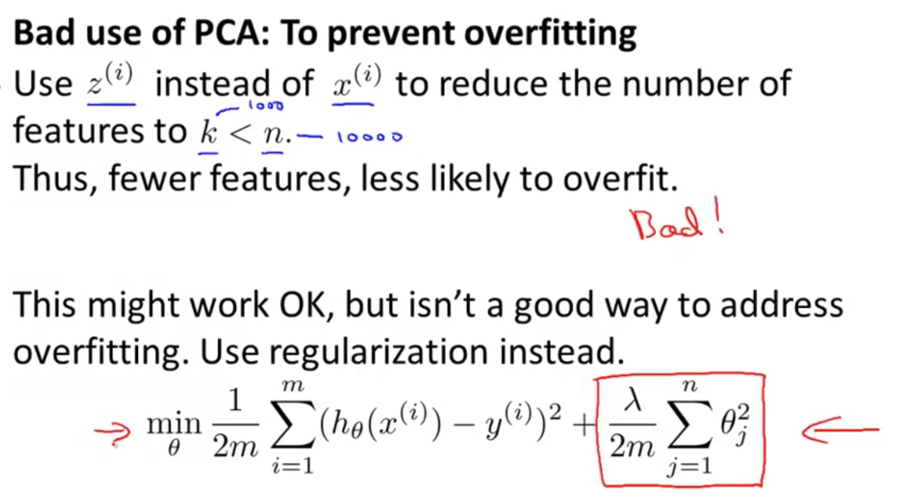

Just to emphasize this is a bad application of PCA and I do not recommend doing this. 

It's not that this method works badly. If you want to prevent over-fitting, there is a much better way to address it; such as use regularization.

And the reason is - if you think about how PCA works, it does not use the labels(y). You are just looking at your inputs x_i, and using that to find a lower-dimensional approximation to your data.

**PCA throws away or reduces the dimension of your data without knowing what the values of y is**. 

This is probably okay if, say you're keeping most of the variance (eg.99%), but it might also throw away some valuable information. It turns out that if you're retaining 99% or 95% of the variance, just using regularization will often give you at least as good a method for preventing over-fitting

Regardless, regularization will often work better than PCA, because when you are applying linear regression, logistic regression or some other method with regularization, this minimization problem actually **knows what the values of y are**, and thus, is less likely to throw away some valuable information. In contrast, PCA doesn't make use of the labels and is more likely to throw away valuable information. 

## Other bad uses of PCA

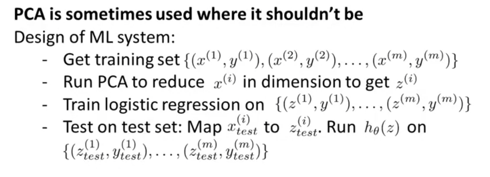

When writing down a project plan, a very good question to ask is - **what if we were to do the whole without using PCA?**

Very often, people do not consider this step before coming up with a complicated project plan and implement PCA. 

I often advise people, before you implement PCA, take whatever it is you want to do and first consider doing it with your original raw data x_i. Only if that doesn't do what you want, then implement PCA before using z_i.

# Summary of main PCA Applications

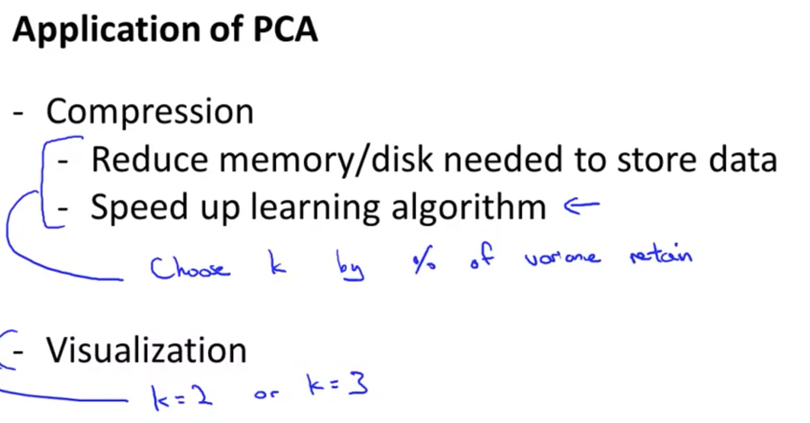