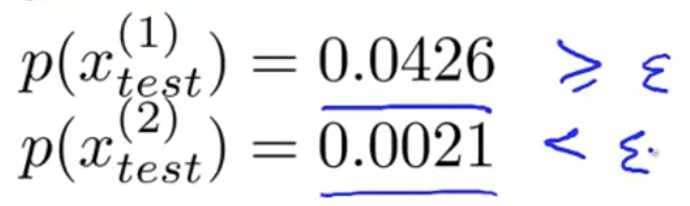

# Problem Motivation

Here, I'd like to talk about a problem called **"Anomaly Detection"**.

This is a commonly use case of machine learning. One interesting aspects is that it's mainly for unsupervised problem, that there's some aspects of it that are also very similar to supervised learning problem.

## what is anomaly detection? 

Imagine that you're a manufacturer of aircraft engines, and your aircraft engines roll off the assembly line.
Then, the quality assurance testing team measure features of your aircraft engine, such as heat generated, vibrations and so on. 

The next day, you have a new aircraft engine that rolls off the assembly line and your new aircraft engine has some set of features x-test. 
The **anomaly detection problem is to figure out whether this aircraft engine is anomalous** in any way.
In other words, we want to know if this engine should undergo further testing or if it's okay to ship it to a customer without further testing?

## More formal explanation

If your new aircraft engine, when plotted in graph above (is the 'anomaly' point) is all the way out there, then we would call that an anomaly.

More formally, in the anomaly detection problem, we give some datasets, x_1 through x_m, and we usually assume that these examples are normal (or non-anomalous).

**The goal is we want an algorithm to tell us if some new example, x_test, is anomalous.**

The approach that we're going to take is given this training set (the unlabeled training set), we're going to build a model for the probability of x, where x are the features of aircraft engines.

Having built a model of the probability of x, we're going to say that for the new aircraft engine:
 - **if p(x_test) < some epsilon, then we flag this as an anomaly.**

Points that are even further out have somewhat lower probability, and the point that's all the way out from the center would be an anomaly. Whereas, the points in the middle would be okay because p(x) is will be high.

## Applications

Some examples of applications of anomaly detection:
 - Fraud Detection
    - Perhaps the most common application
    - Goal is to detect if, amongst the many users and based on their activities, there are any suspicious activities? 
    - Some features you can use might be:
       - how often this user logs in?
       - number of what pages visited?
       - typing speed
       - .etc

  - Manufacturing.
     - We already talked about the aircraft engine thing where you can find unusual aircraft engines and send those for further review.

  - Monitoring Computers in a Data Center
    - If you have a lot of machines in a computer cluster or in a data center, using some features captured (eg. how much memory used, number of disc accesses, CPU load), you can model the probability of x of these machines having different amounts of memory use or probability of these machines having different numbers of disc accesses or different CPU loads and so on. 

    - If you have a machine whose probability of x is very small, then you know that machine is behaving unusually and that machine might be about to go down, and you can flag that for review by a system administrator.

# Gaussian Distribution

Here, I'd like to talk about the Gaussian distribution, which is also called the normal distribution. After this, we'll start applying the Gaussian distribution to developing an anomaly detection algorithm.

Let's say x is a row value's random variable. If the probability distribution of x is Gaussian with mean μ and variance σ^2. Then, we'll write this as , where the script N stands for normal since Gaussian and normal mean the same thing. The Gaussian distribution is parametarized by two parameters: 
  - a mean parameter (denoted μ) 
  - a variance parameter(denoted σ^2).

## Graph and Formula

If we plot the Gaussian distribution (or Gaussian probability density), it'll look like the bell shaped curve:
 - the location of the center of this bell shaped curve is the mean(μ), 
 - the width of it, rougly, is sigma (σ), also called one standard deviation. This specifies the probability of x taking on different values. 

The formula for the Gaussian distribution is sometimes written in short form as . This denotes that the probability of X is parameterized by the two parameters μ and σ^2 (meaning they stay constant, while x is the input). 

The true form of the formula is  

(There's no need to memorize it). 

## Examples

On top left, if μ=0, σ=1, then we have a Gaussian distribution that's centered around 0 with first stdev being 1.

## Parameter Estimation

What's the parameter estimation problem? Let's say we have a dataset of m examples. I've plotted the examples on the horizontal axis in the graph above.

The parameter estimation problem is, suppose that these examples came from a Gaussian distribution, I want to **estimate what the values of μ and σ^2 are?**

The formula for μ and σ^2 is shown above.

Maybe you've seen the formulas above where it is (m-1) instead of m. In machine learning, people tend to learn 1/m formula, but in practice whether it is 1/m or 1/(m-1) doesn't really make a difference assuming m is reasonably large.

# Algorithm

Here, let's apply gaussian distribution to develop an anomaly detection algorithm.

Let's say that we have an unlabeled training set of m examples.
The way to address anomaly detection, is to model p(x) from the data sets. 
x is a vector and we are going to model p(x) = , where x_i is the i-th component (row data). 
Note that we are also assuming that the features, x_1 to x_m, are distributed according to a Gaussian distribution, which can be denoted as:

To make the expression more compact. We can write this is as: 

This funny symbol here is capital Greek alphabet pi, which is a product function of values in its range:

Lastly, the problem of estimating the distribution p(x) is sometimes called
the **problem of density estimation**. 

## Steps

1. Choose features, x_i, that describes the general property of the thing you're collecting data on.
2. Given a training set, of m, unlabled examples, fit the parameters, μ_1...μ_n, and σ^2_1...σ^2_n.
    - Formula is shown in screenshot above.
    - μ is a vector, from μ_1 to μ_n.
3. Given a new example, compute p(x) - what's the probability of this new example? Then, if this probability is very small, then you flag this thing as an anomaly.

## Application

Let's say we have the dataset plotted above.

Looking at features x1 and x2, we can estimate the mean and standard deviation, and then plot separate graphs of p(x1) and p(x2), that might look like a gaussian distribution.

Then, if were to plot of p(x), which is p(x1) * p(x2), you can actually get a surface plot like above.

Now, let's say we have new examples, x^1_test and x^2_test and we want to know - Is this an anomaly or not? 

We compute the probability of them and compare them with a pre-set epsilon, and find that x^2_test is an anomaly.

If you look through the 3d surface plot, it's saying that all the values of x1 and x2 that have a high height above the surface, corresponds to an a non-anomalous example of an OK (or normal) example. Whereas, all the points far out have very low probability, and so we are going to flag those points as anomalous, 
