# Developing and Evaluating an Anomaly Detection System

Here, I like to talk about the process of developing a specific application of anomaly detection to a problem and how to evaluate an anomaly detection algorithm. 

## Importance of real-number evaluation

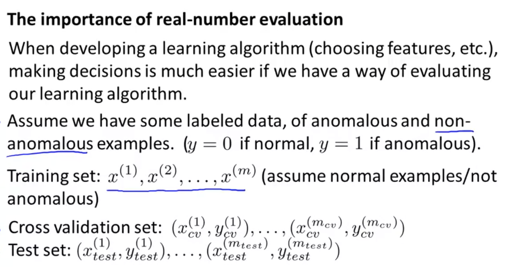

1. real-number evaluation
   - Previously, we've already talked about the importance of real number evaluation and the idea is that when you're trying to develop a learning algorithm for a specific application, you need to make a lot of choices, like choosing what features to use and so on. Making decisions is often much easier if you have a way to evaluate your learning algorithm that just gives you back a number.
2. Assume we have some labeled data of anomalous and unanomalous examples
   - Basically treat anomaly detection as a supervised learning problem.
   - Taking the aircraft engine example, let y=0 be normal and y=1 be anomalous examples.
3. Training set
   - Since we have unlabeled data, training set is unlabled as well.
   - We assume our training set to be a large collection of normal examples. 
   - It's okay if a few anomalous examples slip into your unlabeled training set.
4. Define Cross Validation and Test step
   - We can include a few examples in the cross validation set and the test set that contain examples that are known to be anomalous

## Distribution of training/cv/test set

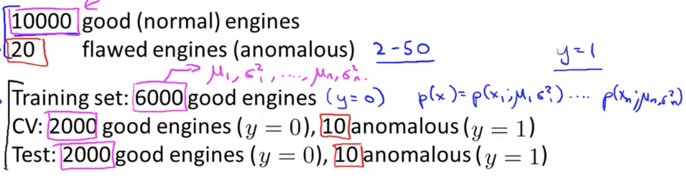

Let's say that we have 10,000 examples of engines that we know are normal.
Given this data set, a fairly typical way to split the training, cross validation and test set would be **60%:20%:20%**.

## Algorithm Evaluation

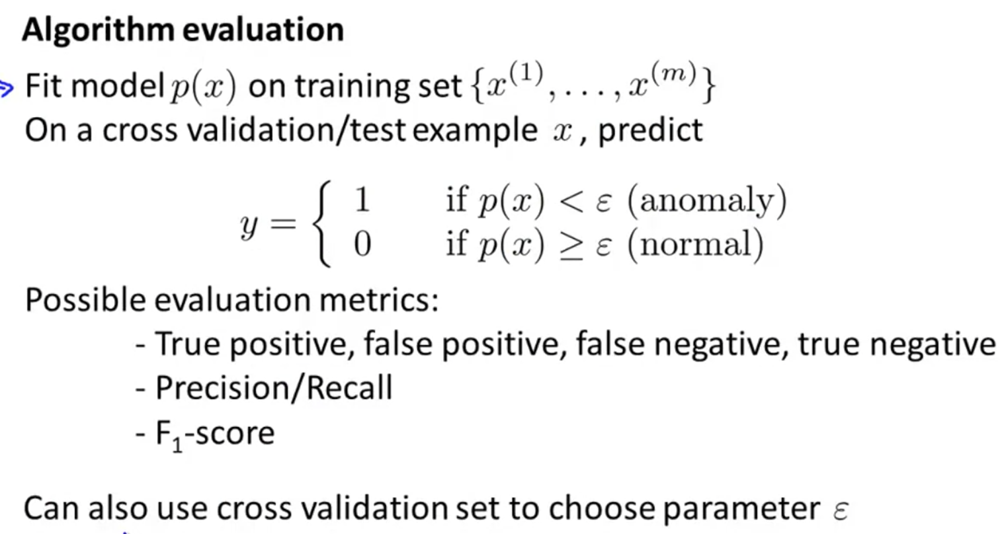

1. Fit model p(x) on training set {x^1, .., x^m}
2. On cross validation/test example x, predict y = 0 or 1 based on p(x) and epsilon.
3. Evaluation Metrics
   - These labels will be very skewed because y=0 (normal examples) will be much more common than y=1 (anomalous examples).
   - But this is much closer to the source of evaluation metrics we can use in supervised learning.
   - Because the data is very skewed, classification accuracy would not be a good metric.
   - True positive, ..., Precision/Recall and F1-score are good choices.

4. Use cross validation set to choose parameter epsilon.
   - Epsilon is this threshold that we would use to decide when to flag something as an anomaly.
   - If you have a cross validation set, a way is to try many different values of epsilon and pick one that  maximizes f1 score.

# Anomaly Detection vs. Supervised Learning

If we have labeled data of some normal and anomalous examples, **why don't we just use a supervised learning?** or logistic regression or neural network? Here, I'll try to share with you some of the guidelines for when you should use an anomaly detection algorithm and when to use supervised learning algorithms.

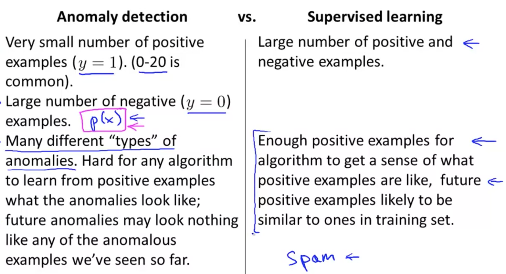

## 1) Number of Anomalous Examples

**If you have a very small number of anomalous examples, you should consider using an anomaly detection algorithm.**

Usually, if we have such a small amount of anomalous examples, we're going to save them just for the cross validation set and the test set. 

The idea is that in many anomaly detection applications, you have very few anomalous examples and lots of normal examples. When we're doing the process of estimating p(x), we need only negative examples to do that. So if you have a lot negative data, we can still fit p(x) pretty well. 

In contrast, for supervised learning, we usually have a reasonably large number of both normal and anomalous examples. 

## 2. Number of different types of anomalies & Detecting unforeseen anomalies

For anomaly detection applications, there are often very different types of anomalies; think about just how many different ways it can go wrong in an aircraft engine.

If you have a pretty small set of anomalous examples, it can be hard for an algorithm to learn from them. In particular, you know future anomalies may look nothing like the ones you've seen so far. 

For example, maybe in your set of anomalous examples, you've seen 5 to 20 different ways that an aircraft engine could go wrong. And maybe tomorrow, you need to detect a totally new set of anomaly; a totally new way for an aircraft engine to be broken that you've just never seen before. 

**If that's the case, it might be more promising to just model the anomalous examples with p(x) instead of trying to model the anomalous examples using supervised learning - Because tomorrow's anomaly may be nothing like the ones you've seen so far.**

## Applications: Shifting between Anamaly Detection and Supervised learning

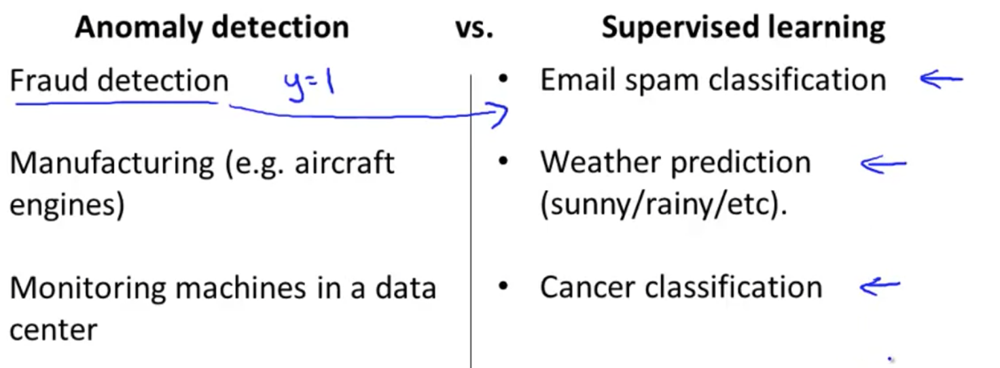

Above are some applications of anomaly detection and supervised learning. However, these are not hard-set; you might **consider shifting anomaly detection to supervised learning (or the other way) depending on the ratio of normal and anomalous examples you are getting**. 

Using Fraud Detection as example, if you have many different types of ways for people to try to commit fraud and a relatively small number of fraudulent users on your website, then I would use an anomaly detection algorithm.

However, let's say you're a major online retailer and you have had a lot of people commit fraud on your website. In that case, you actually have a lot of anomalous examples. Here, you might want to shift over to the supervised learning column. 

But, if you haven't seen that many examples of users doing strange things on your website, then more frequently fraud detection is actually treated as an anomaly detection algorithm rather than a supervised learning algorithm.

In Manufactoring, again, if you see a lot of bad examples, maybe manufacturing can shift to the supervised learning as well. 

# Choosing What Features to Use

It turns out, that when you're applying anomaly detection, one of the things that has a huge effect on how well it does is what features you use to give the anomaly detection algorithm. Here, I'd like to give some suggestions and guidelines for how to go about designing or selecting features give to an anomaly detection algorithm.

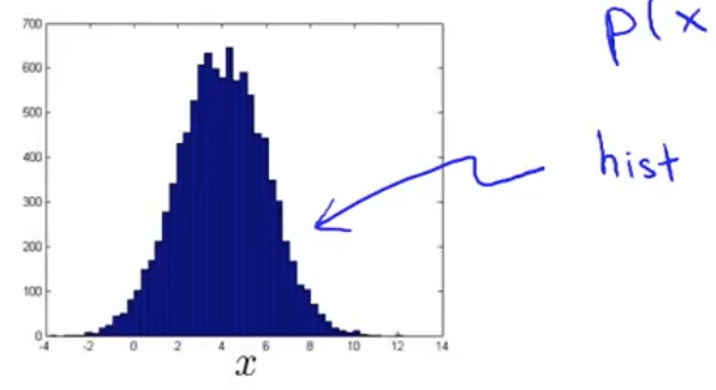

In our anomaly detection algorithm, one of the things we did was model the features using this sort of Gaussian distribution. 

One thing I often do would be to plot the histogram of the data and make sure that the data looks vaguely Gaussian before feeding it to my anomaly detection algorithm. **Incase your data looks non-Gaussian, the algorithms will often work just fine; but it is good practice to have it and it might work better if it's gaussian.**

Another option for when your data doesn't look gaussian is to play with different transformations of the data in order to make it look more Gaussian.

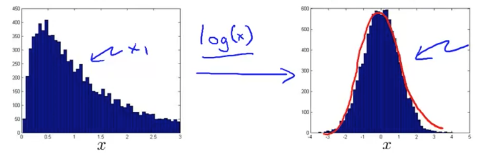

Given the dataset that looks like the above, I might take a log transformation of the data and end up a histogram on the right, which looks much more Gaussian.

## Other transformations

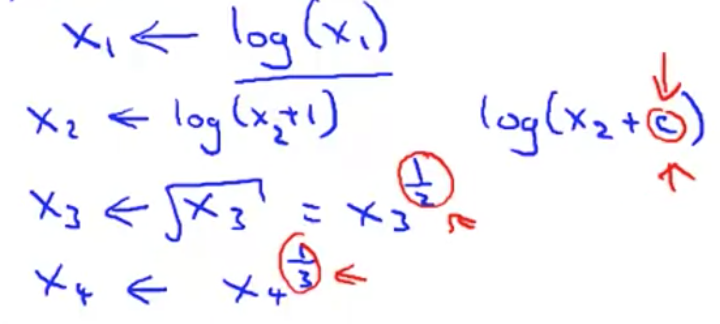

There are other transformations you can do than log; as shown above.

## Histogram in Octave

In octave, you can use the hist(x) command to plot a histogram.

## Coming up with Features - Error Analysis Procedure

How do you come up with features for an anomaly detection algorithm? The way I often do this is via an **error analysis procedure**.

This is similar to the error analysis procedure we have for supervised learning:

1. Train an algorithm.
2. Run the algorithm on a cross validation set.
3. Look at the examples it gets wrong, and see if we can come up with extra features to help the algorithm do better on the examples that it got wrong in the cross-validation set.

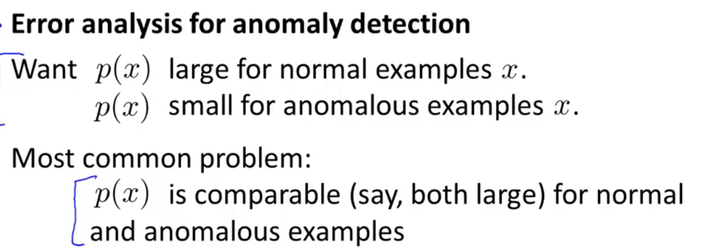

In anomaly detection, we are hoping that p(x) will be:
 - large for the normal examples.
 - small for the anomalous examples.

A pretty common problem would be if p(x) is comparable, maybe both are large for both the normal and the anomalous examples.

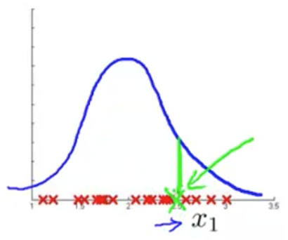

Let's use the data in the graph above as example. I have just one feature, x1. Now, let's say I have an anomalous example (denoted by the green 'x'), which is buried in the middle of a bunch of normal examples,

In this case, I would look at my training examples and look at what went wrong with that particular aircraft engine (in the case of the aircraft engine example). I want to see if that example can inspire me to come up with a new feature, x2, that helps to distinguish between this bad example, compared to the rest of my normal examples.

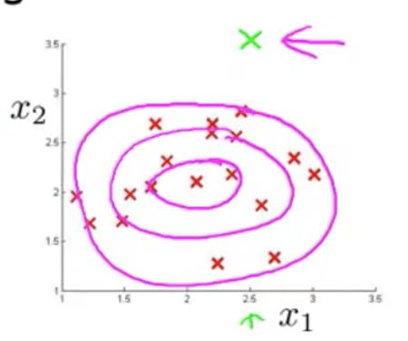

Now, if I model my data, x1 and x2, I'll find that my anomaly detection algorithm gives high probability to data in the central regions and slightly lower probability to the outskirts.

## Choosing Features

Usually, the way I think about choosing features is I want to **choose features that will take on either very large values, or very small values, for examples that I think might turn out to be anomalies.**

Let's use our example of monitoring the computers in a data center. Assume that you have tens of thousands (or more) of machines in a data center. We want to know if one of the machines is acting up or doing something strange.

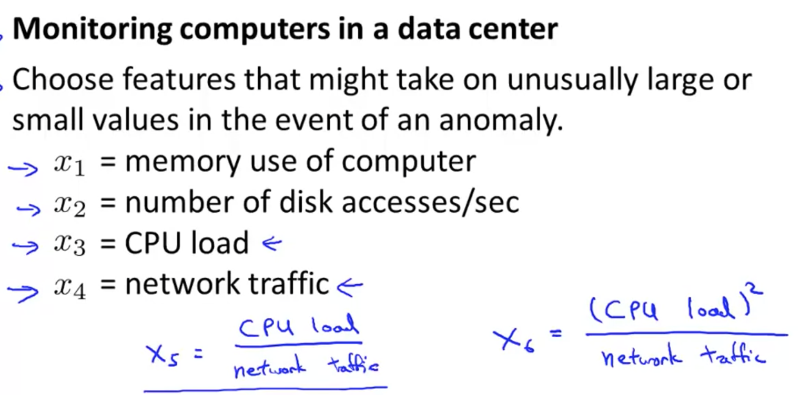

Lets say that I suspect one of the failure cases is that CPU load the network traffic tend to grow linearly with each other. Therefore, one of the failure cases is if the CPU load grows, but the network traffic doesn't. In that case, to detect that type of anomaly, I might create a new feature, x5, which will be defined as (CPU load/network traffic).

You can also get creative and come up with other features as well. For example, a feature, x6, that is defined as (CPU_load^2/network traffic).
And by creating features like these, you can start to **capture anomalies that correspond to
unusual combinations of values of the features**.
