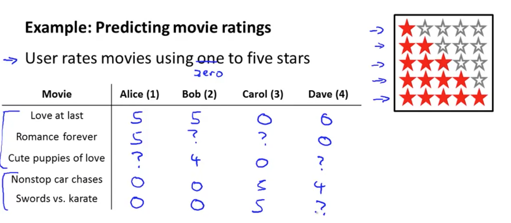
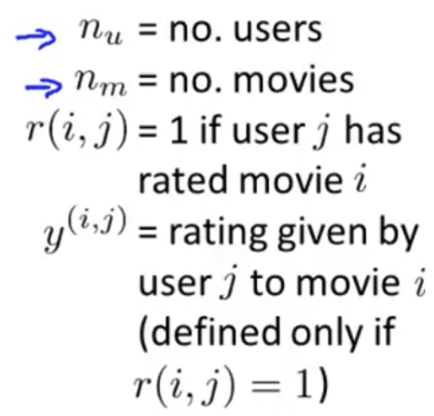
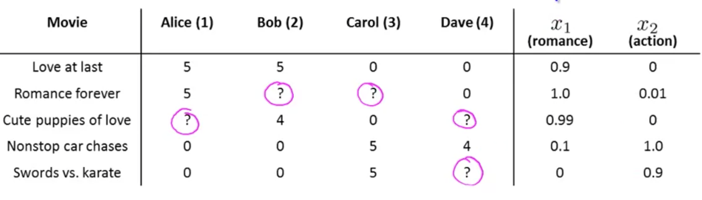
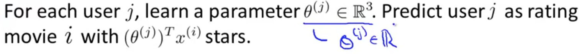
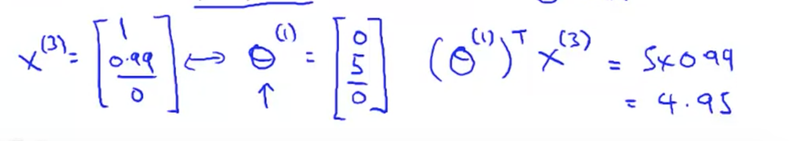
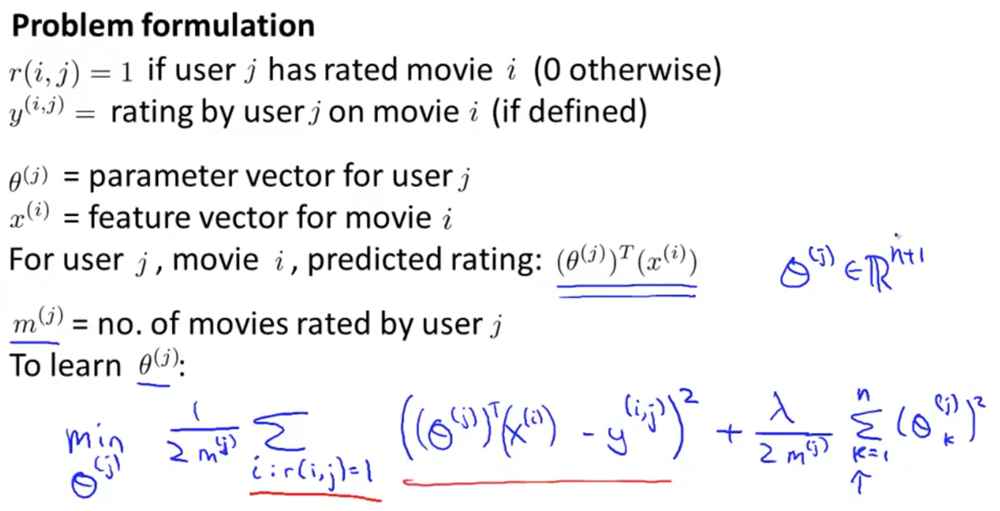
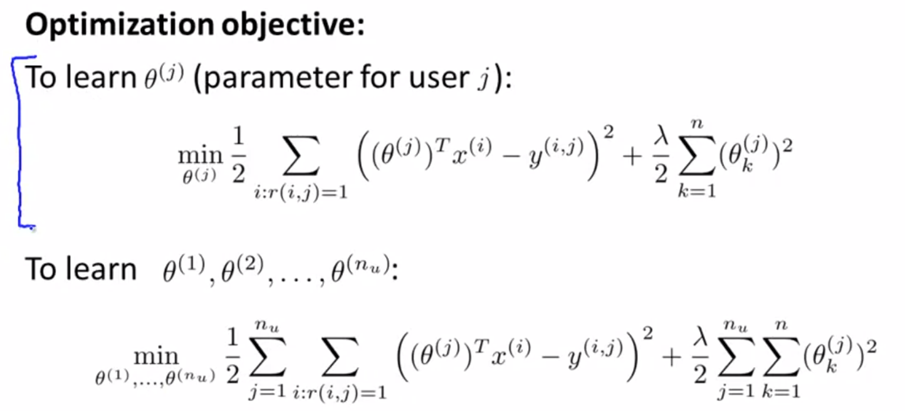
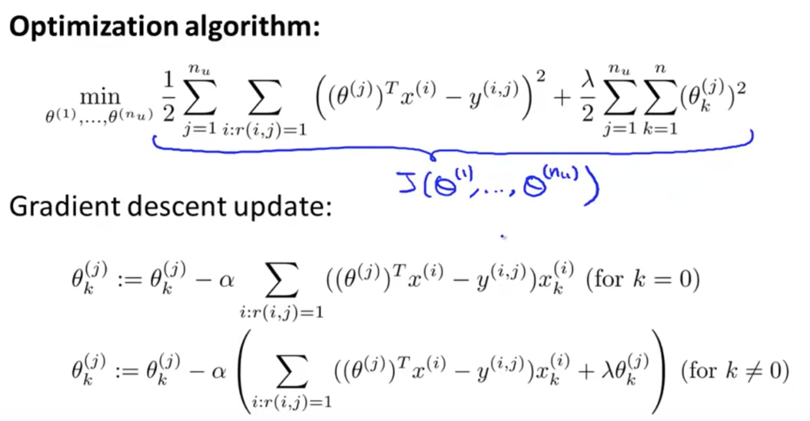

Here, I would like to tell you about recommender systems. There are two reasons why I wanted to talk about recommender systems: 

## 1. It is an important application of machine learning. 
  - One of the most frequent answers I heard from many groups in Silicon Valley is that they are trying to build better recommender systems.
  - If you think about what Amazon or Netflix do, they try to recommend new products to use. 
  - These sorts of recommender systems look at what products you may have purchased in the past, or what movies you have watched in the past.
  - These systems, in fact, are responsible a substantial fraction of Amazon's and Netflix's revenue.
  - And so an improvement in performance of a recommender system can have a substantial and immediate impact on these companies. 
  - Funny enough, Recommender systems receives relatively less attension, and yet, it seems to be a high priority for many companies.
  
## 2. It's one of the big ideas in machine learning. 
  - We've already seen in this class that features are important for machine learning. **The features you choose will have a big effect on the performance of your learning algorithm.**
  - So there's this big idea in machine learning, which is that for some problems, maybe not all problems, but some problems, there are algorithms that can try to automatically learn a good set of features for you. Rather than trying to hand design, or hand code the features, which is mostly what we've been doing so far, there are a few settings where you might be able to have an algorithm, just to learn what feature to use, and the recommender systems is just one example of that sort of setting. 

## Example

As my example, I'm going to use the modern problem of predicting movie ratings. Imagine that you're a website that sells/rents out movies. 

 - Let's say you let your users rate different movies, using a 0 to 5 star rating.
 - I have 5 movies: 
   - You know, Love That Lasts, Romance Forever, Cute Puppies of Love, Nonstop Car Chases, and Swords vs. Karate. 
 - And, 4 users: 
   - Alice, Bob, Carol, and Dave.
 - Also, not all users have rated every movie (denoted by '?')

The above are some notations that we will use.

**The recommender system problem is - given this data, r(i, j)'s and the y(i, j)'s, look through all the movie ratings that are missing and to try to predict what these values of the question marks should be.**

By looking at the data, you know, if Alice and Bob both like the romantic movies, maybe Alice will have give other romantic movies a high rating. 

Our job in developing a recommender system is to come up with a learning algorithm that can automatically fill in these missing values for us. **Basically, you try to predict what might be interesting to a particular user.**

# Content Based Recommendations

Here, I'd like to talk about
our first approach to building a recommender system. This approach is called **content based recommendations**. 

Here's our dataset from before. I have 5 movies. So, how do I predict what these missing values would be? 

Let's suppose that for each of these movies, I have an **additional set of features** for them. In particular, each of the movies have two features, x1 and x2, where
 - x1 measures the degree to which
a movie is a romantic movie 
 - x2 measures the degree to which
a movie is an action movie. 

Suppose that we are able to get the features of x1 and x2 for each of the movies. 

Using "Cute Puppies of Love" as example, my x1 and x2 values are 0.99 and 0 respectively. **Let's add an extra feature as usual, which is my interceptor feature x(0) = 1.** Putting these together, x^(3) = [0; 0.99; 0]

Now in order to make predictions, we **treat predicting the ratings of each user as a separate linear regression problem**. 

Specifically, let's say that for each user j, we're going to **predict user j's rating for movie i using the inner product between parameters vectors(theta; more explained later) and the features (x^i)**. 

Above is example of movie 3(Cute Puppies of Love) and user 1 (Alice). For now:
 - Assume that we have theta^1(will explain more later) 
 - Got x^3 from looking at the movie_rating table. 

**By taking the inner product of x^i and theta^j, we get a prediction for user i's rating for movie j**; in this case, it's 4.95.

## Finding theta^j

Basically, for each user and each movie, we choose a parameter vector(theta^j) so that the predicted values is as
close as possible to the actual answer in our training sets. 

A more formal form is in the screenshot above.

We want to choose the parameter vector(theta^j) to minimize the squared error . You can also add regularization terms.

## Getting Parameters for Multiple Users

In building a recommender system, we don't just want to learn parameters for
a single user. We want to learn parameters for all of our users. 

What I'm going to do is take this optimization objective (on top) and just add the mixture summation, which basically sums my objective over all of my users, then minimize the overall cost. 

## Gradient Descent

From screenshot above, the top is our optimization objective and the bottom is the gradient descent algorithm. This gradient descent update look a lot like what we have here for linear regression, and that's because these are essentially the same as linear regression. 

If you want, you can also plug them into a more advanced optimization algorithm, like conjugate gradient or
LBFGS or what have you, and use that to try to minimize the cost function j as well. 
