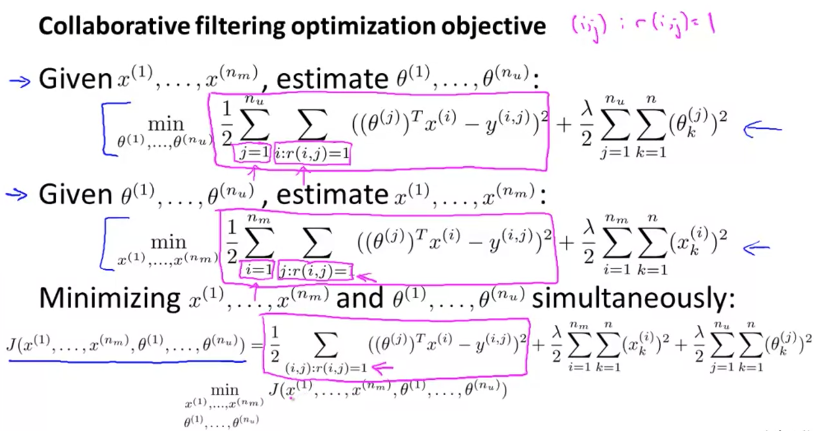
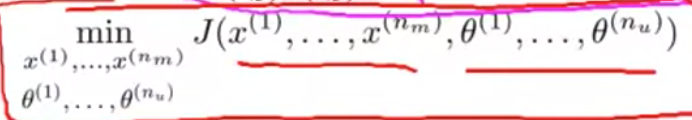
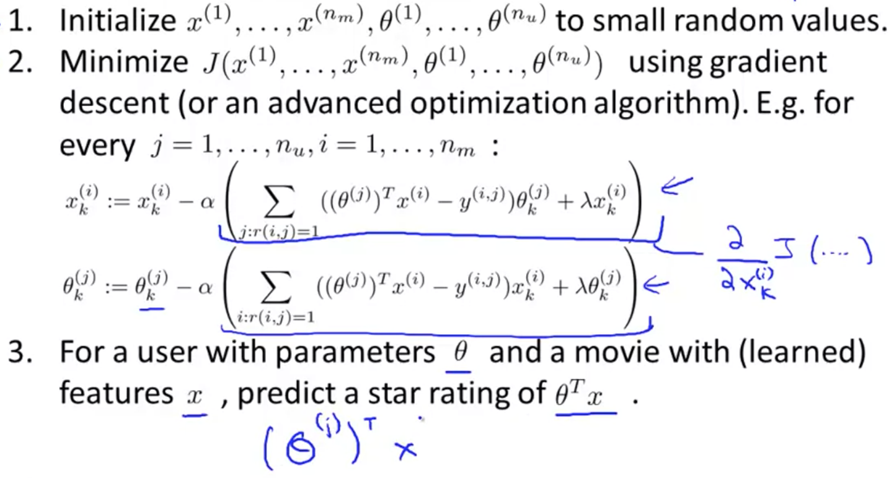

# Collaborative Filtering

Here, we'll talk about an approach to building a recommender system, called **collaborative filtering**. 

The algorithm that we're talking about does something called **feature learning**. What that means is it will be an algorithm that can start to learn for itself what features to use. 

Here was the data set that we had. We assumed that for each movie, someone had come and told us how romantic that movie was and how much action there was in that movie; denoted by x1 and x2. But as you can imagine it can be very difficult, time consuming and expensive to actually get someone to watch each movie and tell you how romantic each movie and how action packed is each movie, and often you'll want even more features than just these two. 

So where can you get these features from? Let's change the problem abit.  Suppose we have a data set where we do not know the values of these features (x1, x2) - I've marked all the x1, x2's with '?'.

We're given the dataset of movies and of how the users rated them, but we have no idea how romantic or action-packed each movie is. 

Let's make a slightly different assumption - Let's say we've gone to each of our users and asked how much they like the romantic and action movies? 

Supose the dataset we collected is:
 - Alice and Bob give a 5 for romantic movies, and 0 for action movies.
 - Carol and Dave gave a 0 for romantic movies, and 5 for action movies.

Looking at movie 1 (Love at last), we see that:
 - Alice and Bob loved this move. 
 - Alice and Bob rated romantic movies with a 5.
 - Carol and Dave hated this movie.
 - Carol and Dave rated romantic movies with a 0.
 
Therefore, we might reasonably conclude that this is probably a romantic movie; probably not much of an action movie. 

This example is mathematically simplified, but what we're really asking is, **for Alice's rating of movie1, what feature vector should x1 be so that theta1 * x1 is approximately equal to 5?**

From this, it looks like, x1_0 = 1 ( that's the intercept term), and then 1.0, 0.0.

Since we know of Alice, Bob, Carol, and Dave's preferences for movies and the way they rated this movie, we can go down this list and try to figure out what might be reasonable features for these other movies as well. 

## Finding x^i

Let's formalize this problem of learning the features x^i. Let's say that our users have given us their preferences and told us the values for theta_1 to theta_n. We want to learn the feature vector, x_i, for movie number i. 

The optimization problem is to sum of the cost functino, where we want to minimize the squared error, which is the difference between what we predict and the actual answer.

As usual, we can also add a regularization term to prevent the features from becoming too big. 

To learn all the features for all the movies, I'm going to do is add this extra summation to sum over all n_m movies and minimize the sums of all movies. If you minimize this, you will have a reasonable set of features for all of your movies. 

## Collaborative Filtering

Using the movie rating example, the term, collaborative filtering, refers to the observation that **when you run an algorithm with a large set of users, these users are effectively collaborating to get a better movie rating system.** By helping the system learn better features, these features can then be used by the system to make better movie predictions for everyone else. 

Previously, we talked about - if you have x^1 to x^m, then you can learn theta_1 to theta_u. In contrast, here, we talked about - if you have theta_1 to theta_u, then you can learn x^1 to x^m. 

This is kind of a chicken and egg problem. Which comes first? 

What you can do is:

1. Randomly guess some value of the thetas. 
2. Based on your initial random guess for the thetas, use the procedure we just talked about here and learn features for your different movies. 
3. Given some initial set of features for your movies, you can then use the first method(from previously) to try to get even better estimate for your parameters theta.
4. Now that you have better parameters theta for your users, we can use that to get a better set of features and so on.
5. We can keep iterating, going back and forth and optimizing theta and x.

This is a basic collaborative filtering algorithm. Note that this isn't the final algorithm that we're going to use. 

For this problem, this is possible only because each user rates multiple movies and hopefully each movie is rated by multiple users. Then, you can do this back and forth process to estimate theta and x. 

# Collaborative Filtering Algorithm

Previously we talked about:

 1. If you're given features for movies, you can use that to learn parameters data for users. (first algo above)
 2. If you're given parameters for the users, you can use that to learn features for the movies. (second algo above)
 3. Going back and forth between two algorithms to minimize theta and x

Here, we're going to take those ideas and put them together to come up with a more effcient collaborative filtering algorithm. 

**What we are going to do, is basically take both of these optimization objectives, and put them into the same objective. (third algo)**

## Combining Algorithms

Some things to notice is:

1. **Squared error term** is the same in first and second algo. The only difference is the summations:
    - The first summation is - for every user, J, sum over all the movies rated by that user.

   - The second summation does things in the opposite order - For every movie, I, sum over all the users, J, that have rated that movie.

   - The third summation is summations over all pairs (i,j) for which r(i,j) = 1. Basically, for all the user-movie pairs for which you have a rating. 
2. **Regularization** term
   - First regularization is in terms of theta.
   - Second regularization is in terms of x.
   - The third algo includes the first and second regularization term.

Then, we will treat this cost function as a function of x and theta parameters, and **minimize the entire thing**.

The only difference between this and the older algorithm is that, **instead of going back and forth, we are going to do is just minimize with respect to both sets of parameters simultaneously**.

## Removing x(0)

Finally, when we're learning the features this way, we don't need to include x(0), which was previously used as a convention that corresponds to an interceptor.

This is because when we are using this sort of formalism, we're actually learning the features - there is no need to hard code the feature that is always equal to one. 

If the algorithm really wants a feature that is always equal to 1, it can choose to learn one for itself. If the algorithm chooses, it can set the feature x1 = 1. Therefore, there's no need to hard code the feature of [0;0;1] because the algorithm now has the flexibility to learn it by itself. 

## Steps

1. Initialize x and theta to small random values. 
2. Minimize the cost function using gradient descents or one of the advance optimization algorithms. 
3. Given a user, predict movie rating using product of theta and x.

That's the collaborative filtering algorithm. If you implement this algorithm, you actually get a pretty decent algorithm that will simultaneously learn x and theta.

