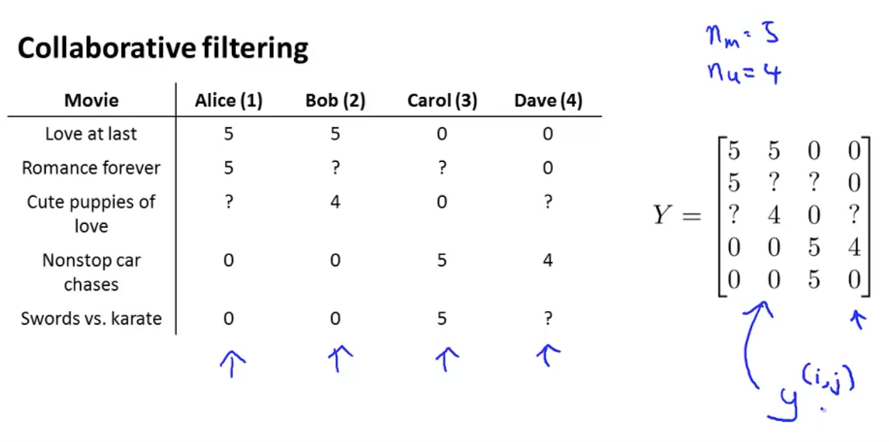
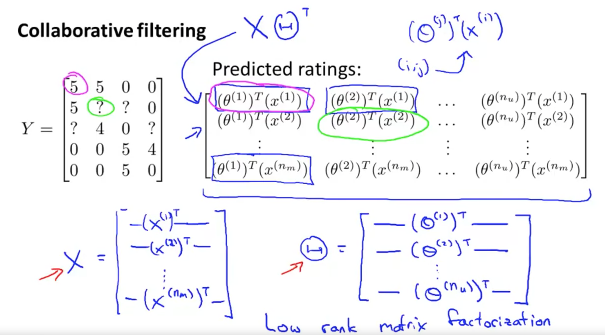
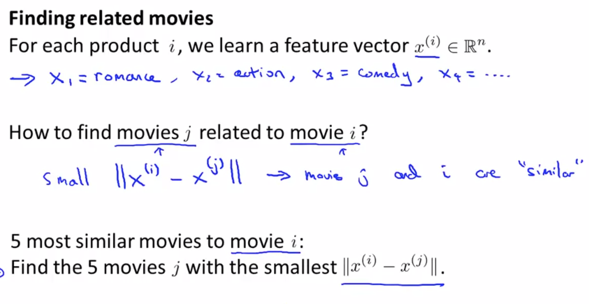
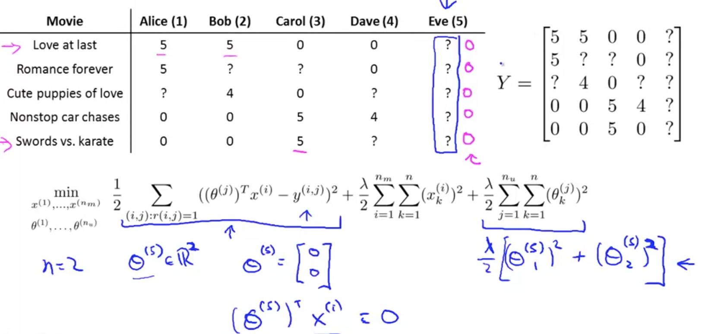
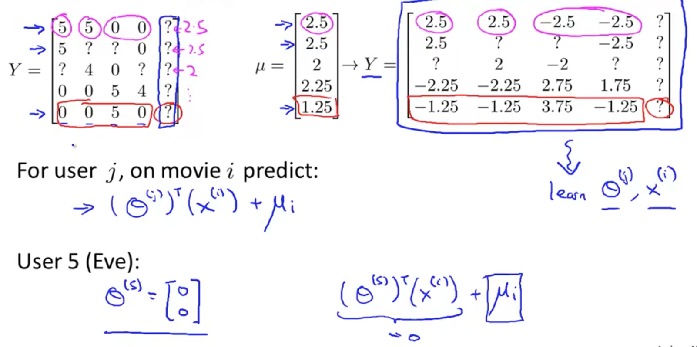

# Vectorization: Low Rank Matrix Factorization

Here, I'm going to talk about the **vectorization implementation of the collaborative filtering algorithm and what you can do with it**.

## Vectorization

To start, here is our dataset with our five movies. I'm going to take all the ratings by all the users and group them into a matrix. Since we have five movies and four users, the matrix y is a 5x4 matrix. 

An alternative way of writing the matrix y is to create a matrix that predicts - **How will user, j, rate movie, i?**

To define x and theta, I will take them and stack them in rows. X and theta will be defined in the format shown above.

Now given this definition for the matrix x and matrix theta, you can just compute x times theta(transpose).

The algorithm that we're using is also called **low rank matrix factorization**. This term comes from the property that this matrix x times theta transpose has a mathematical property in linear algebra called that this is a low rank matrix.

In case you don't know what low rank means, don't worry about it. You really don't need to know that in order to use this algorithm. 

For each movie i, we've learned a feature vector x^i. From this, even though sometimes you might not know what a certain features can really do to help predict y, if you run the algorithm, the algorithm will capture the important aspects of these different movies.

## Finding Related Movies

Say you have some specific movie i and you want to find other movies j that are related to that movie. 

Now that you have learned these feature vectors, this gives us a very convenient way to measure how similar two movies are. 

Simply find the **distance between x^i and x^j**. If the distance is small, there is a pretty strong indication that movies j and i are somehow similar. 

I your user is looking at some movie i and if you want to find the 5 most similar movies to that movie in order to recommend 5 new movies to them, you can find the five movies j, with the smallest distance between the features between these different movies. 

# Implementational Detail: Mean Normalization

Here, I want to share one last implementational detail, namely **mean normalization**, which can sometimes make the algorithm work a bit better. 

Let's consider an example of where there's **a user that has not rated any movies**.

In addition to our four users, I've added a fifth user, Eve, who hasn't rated any movies. Let's see what our collaborative filtering algorithm will do on this user. 

Assuming n = 2, we're going to learn two features for parameter vector theta5. 

Because Eve hasn't rated any movies, there are no movies for which r(i,j) is equal to one. As a result, the cost function plays no role (because the summation condition is r(i,j) = 1).
The only term that affects theta5 is the regularization term on theta^i_k.

If your goal is to minimize this term, you're going to end up with theta5 = 0, because a regularization term is encouraging us to set parameters close to 0. Because cost function (first term) doesn't effect theta5, there is no data to try to pull the parameters away from 0.

Therefore, we end up predicting that Eve is going to rate every single movie with zero stars. But this doesn't seem very useful, does it? If we're predicting that eve is going to rate everything 0 stars, we also don't have any good way of recommending any movies to her, because you these movies are getting exactly the same predicted rating for Eve, and thus, there's no one movie with a higher predicted rating that we could recommend to her.

The solution is **mean normalization**.

## Mean Normalization

To perform mean normalization, before implementing collaborative filtering:

1. Compute the average rating for each movie obtained; call it μ(mu).

2. Subtract y from μ; y = y - μ.

Then, when I want to **make predictions of movie ratings**, I'm going to do the following: 

1. for user J on movie I, predict theta j (transpose) x^i **+ μ**. 
   - We need to add μ, because I had subtracted off the means earlier. Therefore, I need to add back in the mean when predicting.

This actually makes sense. It says that if Eve hasn't rated any movies, we just don't know anything about this new user. Therefore, we're going to predict the average rating for each of the movies for her.

## Movies with no Ratings

In case you have some movies with no ratings, you can play with versions of the algorithm, where you normalize the different columns to have means zero, instead of the rows. 

Or maybe you just shouldn't recommend that movie to anyone?

To summarize, that's how you can do mean normalization as a sort of pre-processing step for collaborative filtering. Depending on your data set, this might sometimes make your implementation work abit better as well.
